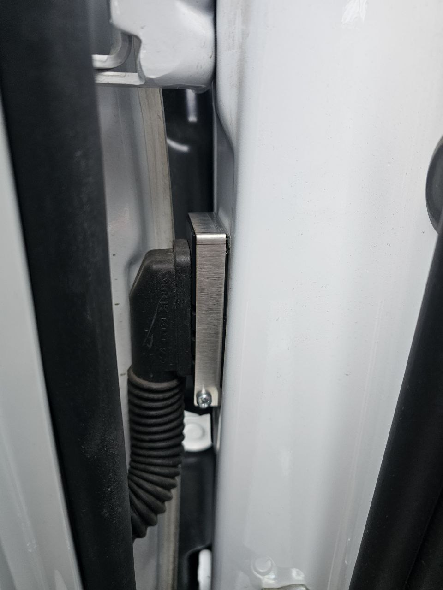
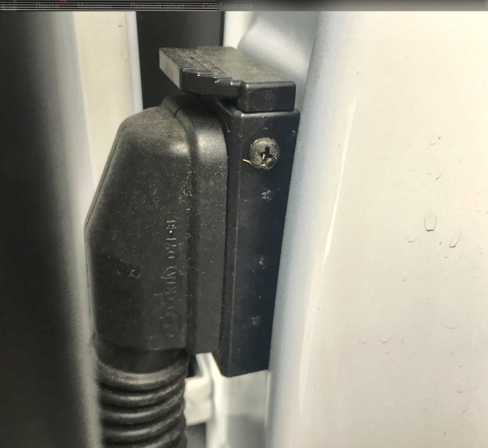

# Прочие средства безопасности

## Защитные скобы на разъемы дверей
### Зачем это нужно?

В щель между крылом и дверью, можно просунуть крючек и снять (отключить) разъем, который идет к двери. После отключения разъема не будут работать концевики двери и это позволяет открыть дверь автомобиля без сработки сигнализации. А далее можно просто отключить предохранитель сигнализации и при этом не будет никаких уведомлений.

[Видеопример](https://t.me/Kia_Sportage_5_Turbo/36156/136563)

### Статьи про установку

- [Drive2 Zubastic](https://www.drive2.ru/l/716992633058100093/)
- [Drive2 peterL](https://www.drive2.ru/l/649169533176650019/)

??? success "Фотографии примеров установки"
    

### Где купить

- [Wildberries]https://www.wildberries.ru/catalog/31047915/detail.aspx?size=67882112
- [Avito](https://www.avito.ru/lobnya/zapchasti_i_aksessuary/zaschita_razema_dveri_kia_hyundai_1976717512)

### Альтернативный метод защиты

Евгений, предложил следующий вариант: вкрутить короткий шуруп/винт в разъем так, чтобы он не давал замку разъема подняться вверх и отключиться.

??? success "Фото от Евгения"
    
    { loading=lazy }