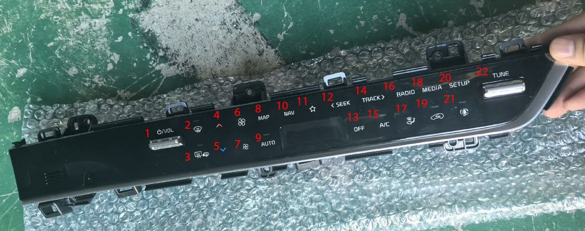
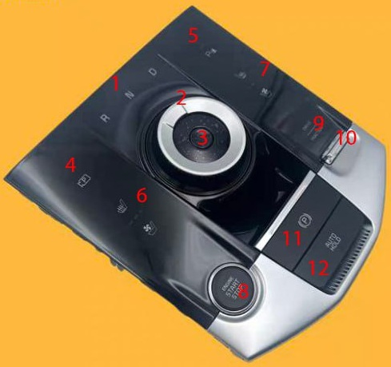
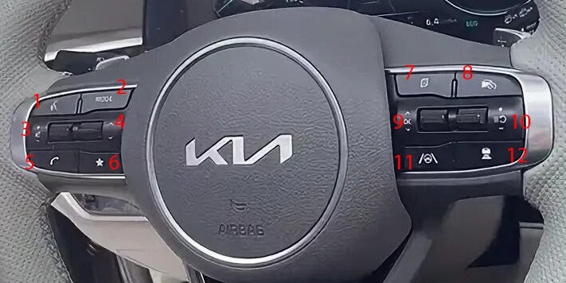
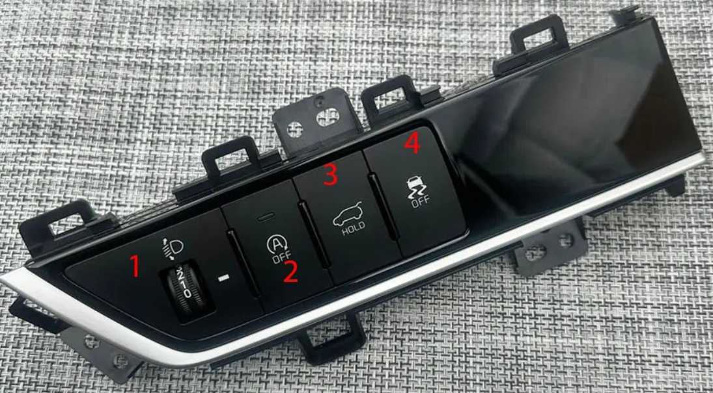

# Описание назначения кнопок в салоне
## Панель климата
Вид панели в комплектации Premium и выше:

{ loading=lazy }

1.  Увеличение и уменьшение громкости  при нажатии ручажка вверх и вниз, при нажатии вглубь ставится фоновая заставка (обычно часы)
2. Обдув лобового стекла на максимум
3. Обогрев заднего стекла и зеркал
4. Увеличение температуры климата +0.5
5. Уменьшение температуры климата -0.5
6. Увеличение скорости обдува (максимальный - 8)
7. Уменьшение скорости обдува
8. Вывод карты
9. Климат-контроль
10.  Навигация
11. Избранное (кнопка программируемая)
12. Предыдущий трек/станция
13. Выключить климат
14. Следующий трек/станция
15. Кондиционер
16. Радио
17. Направление потока воздуха обдува
18. Медиа с флешки или Bluetooth
19. Рециркуляция
20. Натройки (выведутся на ШГУ)
21. Ионизация воздуха
22. Настройка частоты радио

## Консоль АКПП

{ loading=lazy }

1. Режимы КПП 
2. Шайба переключение КПП
3. Паркинг
4. Камера заднего вида/360
5. Парктроники
6. Подогрев/вентиляция водительского сидения (есть только в Flagship)
7. Подогрев/вентиляция пассажирского сидения
8. Запуск/выключение двигателя
9. Типы езды (DRIVE/TERRAIN)
10. Рычажок переключение режимов езды
11. Ручник
12. Автохолд (автоматическое удержание тормоза при остановке, чтобы тронуться нужно нажать газ)

## Руль

{ loading=lazy }

1. Голосовое управление
2. Режимы музыки (программируемая кнопка можно выбрать источники музыки какие нужны)
3. Управление громкостью ШГУ (При нажатии на рычажок звук заглушается/восстанавливается)
4. Переключение треков станций и т.д.
5. Ответить на звонок / вызврать телефонный справочник
6. Избранное (кнопка программируемая, можно например сделать как повесить трубку)
7. Переключение информации на приборной панели
8. Круиз-контроль
9. Перелючение вкладок информации на приборке (например, расход топлива в текущую поездку или с момента заправки)
10. Управление круиз-контролем 
11. Ассистент вождения (удерживать -  вкл/выкл удержание в полосе, короткое нажатие помощь в рулении)
12. Регулировка расстояния от впереди идущей машины, при включенном круизе-контроле

## Панель под рулем

{ loading=lazy }

1. Наклон фар
2. Старт-стоп (по умолчанию включен, выключен когда горит кнопка)
3. Открытие багажника
4. Короткое нажатие - включение/отключение ESC, длинное нажатие - отключение всех систем стабилизации