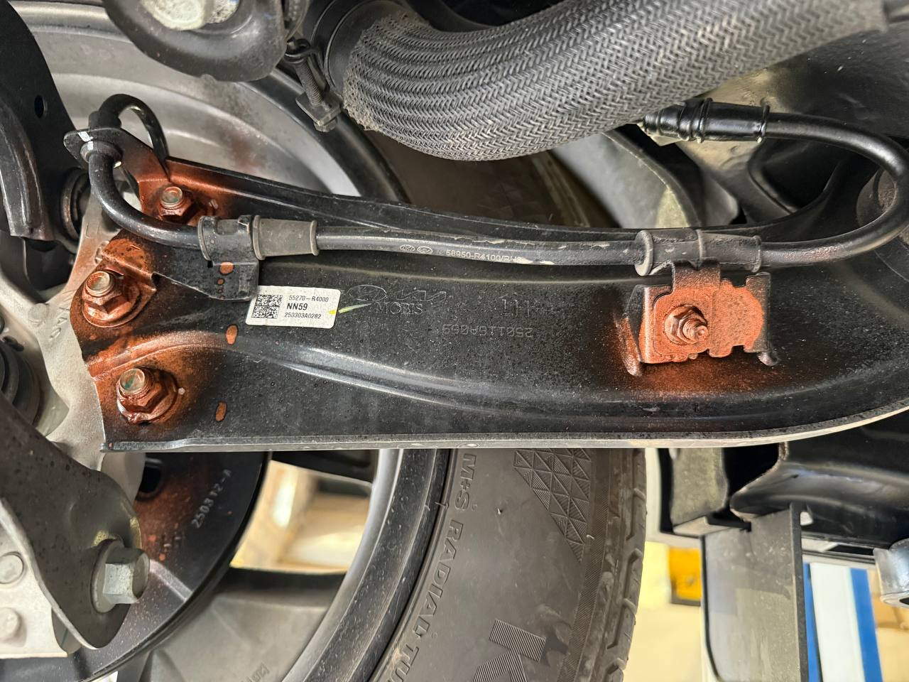

# Рекомендации после покупки

## Мероприятия

1. Антикор (отсутствует заводской антикор, только герметик)
   
??? info "А нужен ли антикор?"
    Решать вам....

    { loading=lazy }
    { loading=lazy }
    { loading=lazy }
    { loading=lazy }
    { loading=lazy }
    { loading=lazy }
    { loading=lazy }
    { loading=lazy }
    { loading=lazy }
    { loading=lazy }
    

1. Заменить жидкость в муфте
2. В 5000 км или 150 ± моточасов заменить моторное масло и фильтр
3. Профилактика полного привода (смазку на заводе жалеют)
4. Защитить регулировочные болты (сход-развал)
   
    ??? info "Фото" 
        { loading=lazy }

5. Опционально:
    - Смазать направляющие тормозных суппортов
    - Сход-развал, балансировка колес
    - Замена поводков дворников на версию из Казахстана (у Китайцев специфический метод крепления дворников)

## Проверки
1. Проверить давление в шинах (бывают сильно перекачены)
2. Проверить и затянуть минусовую клемму (при транспортировке ее снимают и потом нормально не затягивают)
3.  Проверить уровни жидкости: редуктор, АКПП, двигатель

## Приобретения/мероприятия (опционально):
1. Коврики
2. Сигнализация
3. Видеорегистратор
4. Защиты картера, бензобака, редуктора
5. Сетка на передний бампер для защиты радиатора
6. Бронепленка (у машины очень мягкое лако-красочное покрытие)
7. КАСКО
8. Зимняя резина / диски
9. Заменить домкрат. Он не всегда готов держать массу автомобиля
    
    ??? warning "Результаты использования домкрата"
        { loading=lazy }