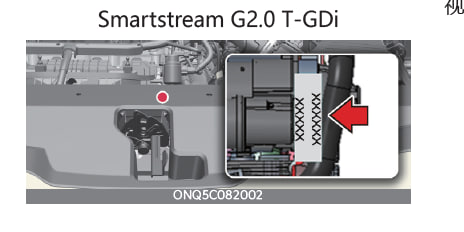
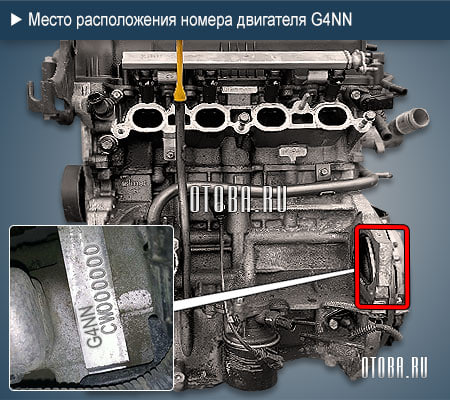
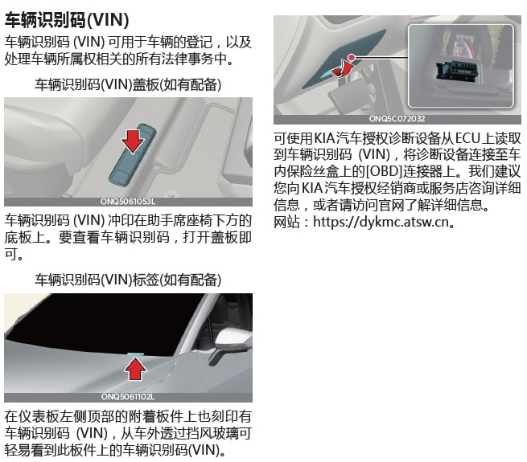
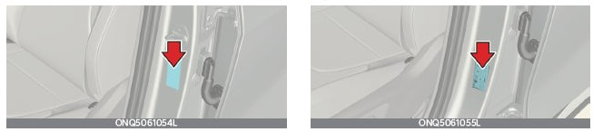
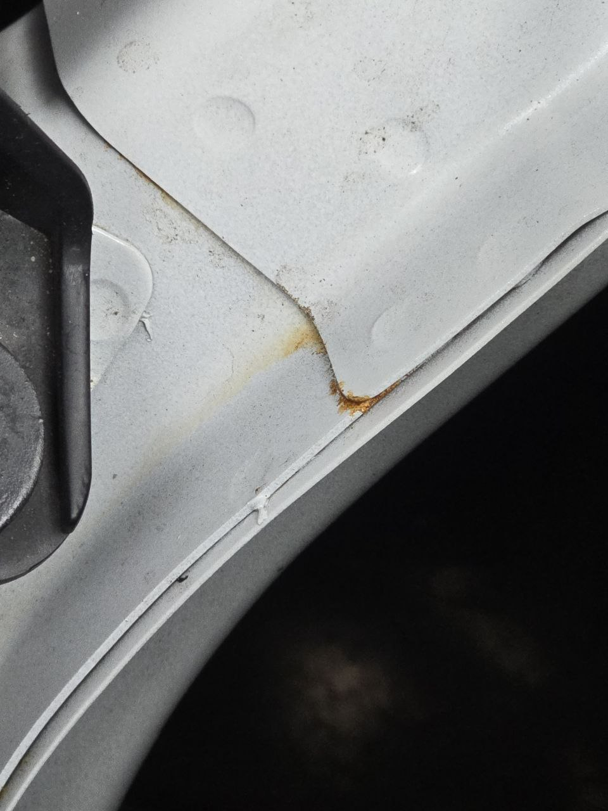
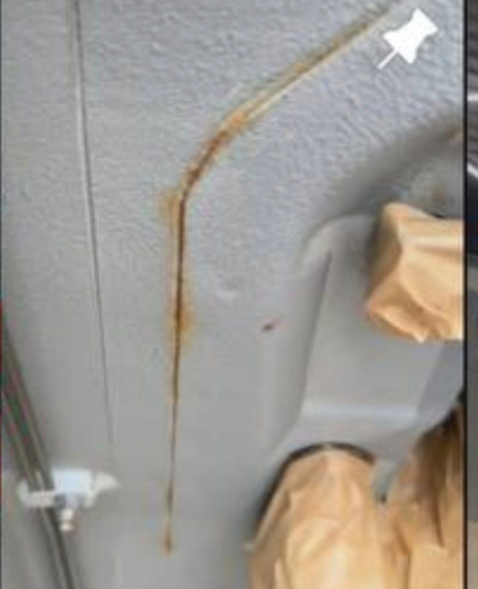

# Вопросы-ответы

## Что нужно сделать после покупки?

??? question "Ответ"
    [Подробная информация](expluatation/new_car.md)

## Какие размеры у штатных дисков и резины?

??? question "Ответ"
    
    **Для 19 диаметра (идёт для максимальной комплектации 2.0T):**
    
    Диски -  R19 7.5J 5X114.3 ET 51 dia 67.1 
    
    Шины - 235/55 R19

    **Для 18 диаметра параметры:**
    
    Диски -  R18 7.5J 5X114.3 ET 51 dia 67.1

    Шины -  235/60 R18
    
    **Для 17 диаметра (минималка Казахской/Российской сборки):**
    
    Диски R17 7J 5X114.3 ET <неизвестно> dia 67.1 
    
    Шины 235/65 R17

    **Головка для гаек диска** - 21

## Где располагается номер двигателя?

??? question "Ответ"
    
    Ответ есть на странице 9-13 [руководства](./expluatation/manuals.md): 
    
    { loading=lazy }

    { loading=lazy }

## Где располагается VIN?

??? question "Ответ"    

    1. Под капотом, под жабо
    2. Наклейка на стойке переднего пассажира
    3. Наклейка может быть на кромке 5-ой двери

    Информация о наличии VIN находится на страницах 9-11 и 9-12 [руководства](./expluatation/manuals.md), но она не верна, т.к.:
    
    1. По инструкции VIN должен быть выбит под сиденьем пассажира, но его там нет.
    2. Нет информации о VIN под капотом
   
    { loading=lazy }
    { loading=lazy }

## Как проверить уровень масла в АКПП?

??? question "Ответ"  
    Щупа нет, но уровень проверить можно:

    - Завести авто, прогреть АКПП до 55°C (± 5°C)
    - Перевести АКПП в Drive (D)
    - Открутить контрольную пробку на передней поверхности АКПП
    
    Должно уверенно капать.

## Какая коробка установлена?
??? question "Ответ"  
    8-и ступенчатый автомат

    1.5Т - A8MF1 
    
    2.0T - A8LF1

## Как отключить старт-стоп (A-OFF)?
??? question "Ответ"  
    [Почитать об этот тут](improvement/start-stop-off.md)

## Какое масло лить в <мотор / коробку / редуктор / муфту>?

??? question "Ответ"
    [Все о масле](service/oil.md)

## Как отключить автоматическое включение кондиционера?

??? question "Ответ"
    В настройках климата: обдув/запотевание

## Где заказать оригинальные запчасти из Китая / Кореи?

??? question "Ответ"
    Вам к [Евгению](https://t.me/evgeen55)
    
    [Хотите Aliexpress (за оригинальность не ручаемся)](https://aliexpress.ru/store/1100367435?spm=a2g2w.detail.0.0.79a83699mxDeji&page=1&SearchText=kia)

## Как перевести коробку в нейтраль?

??? question "Ответ"
    Есть 2 варианта:
    
    ??? info "1. Как описано в инструкции, но машина все равно перейдет в паркинг, если открыть двери."
        **Выполняется на запущенном двигателе**

        1. Отключить "Автоматическое удержание" и ручной (стояночный) тормоз.
        2. Нажать педаль тормоза.
        3. Переключить шайбу в положение N.
        4. На панели приборов появится предупреждение. Нажмите "ОК" на руле, чтобы оставить нейтральное положение
        5. Выключить двигатель

    ??? info "2. Альтернативный способ, машина не переходит в паркинг после открытия двери."
        **Выполняется на заглушенном двигателе**

        1. Не нажимая педаль тормоза, переводим зажигание в ON "2 раза нажать на кнопку Start"
        2. Нажимаем тормоз
        3. Переводим шайбу в положение N
   
        Зажигание останется в статусе "ON", но можно выходить из машины и она не перейдет в паркинг. При этом нельзя снимать клемы с акумулятора, т.к. после появления питания машина перейдет в паркинг.

## Как заменить батарейку в пульте?

??? question "Видео"

    

    <iframe width="560" height="315" src="https://www.youtube.com/embed/Gv1TwdZwMIo?si=xUu0lkxKDTBoCSfr" title="YouTube video player" frameborder="0" allow="accelerometer; autoplay; clipboard-write; encrypted-media; gyroscope; picture-in-picture; web-share" referrerpolicy="strict-origin-when-cross-origin" allowfullscreen></iframe>
    

## Нужен ли антикор?

??? question "Смотрите и решайте сами..."
    

    { loading=lazy }
    { loading=lazy }
    { loading=lazy }
    { loading=lazy }
    { loading=lazy }
    { loading=lazy }
    { loading=lazy }
    { loading=lazy }
    { loading=lazy }
    { loading=lazy } 

## Как заменить резинки дворников?

??? question "[Инструкция](service\manuals\smena_rezinok.md)"
    