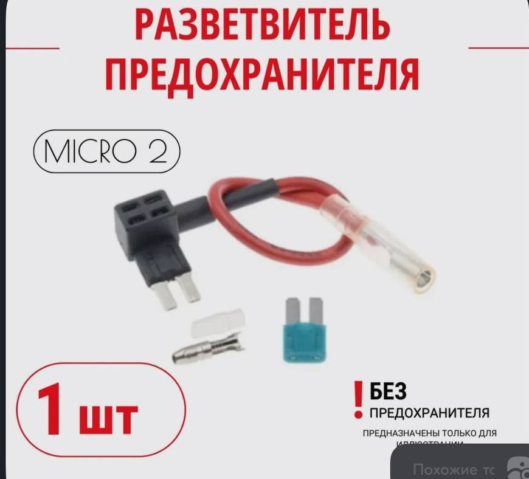
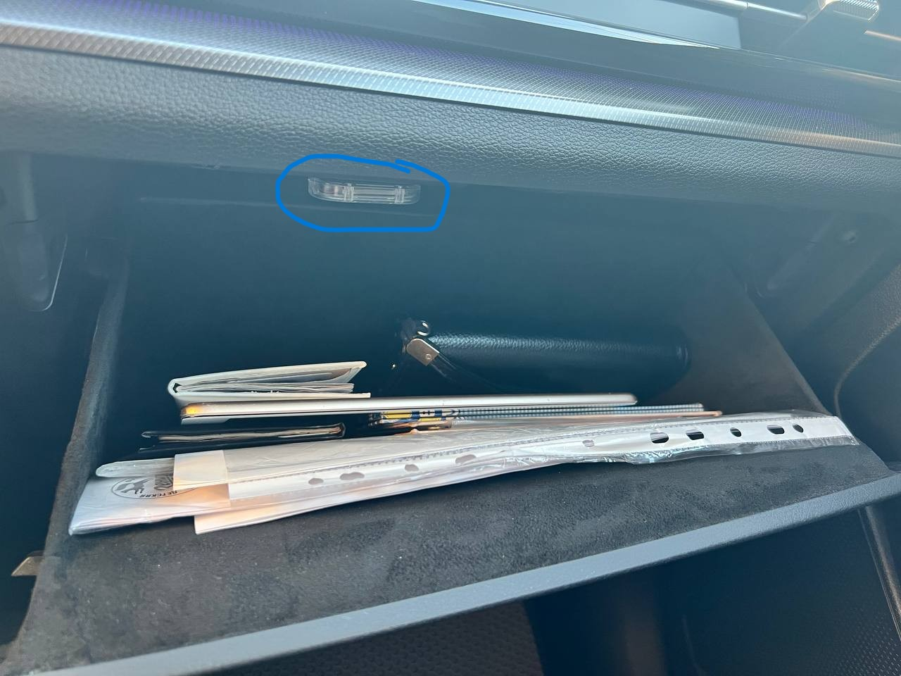

# Установка освещения в бардачке

## Вариант 1

1. Концевик (93510-21000) - придется врезать самостоятельно (нет штатного места)
2. Подсветка (84547-P2000) или из [Aliexpress](https://sl.aliexpress.ru/p?key=vrHbViI)
3. Разветвитель предохранителя (Micro-2)

??? Фото
    
    
    

## Вариант 2

Просто купить светильник от батареек, USB и т.п.

??? Фото
    

[WB вариант от 5В (USB)](https://www.wildberries.ru/catalog/191179562/detail.aspx?size=312352202)
