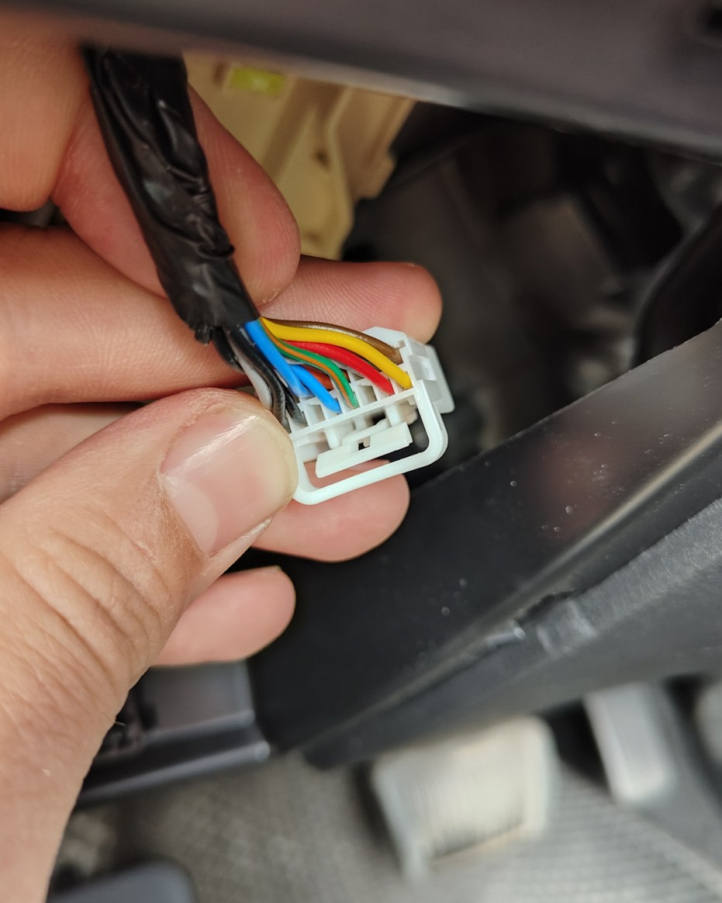

# Отключение функции старт/стоп

Для отключения данной функции есть 2 метода:

1. Отключение через расширенное программиование сигнализации (реализуется на этапе установки)
   
2. С помощью "обманки", которая может быть установлена собственными силами за 5-10 минут.

    - откройте блок предохранителей в салоне
    - отключите и вытяните разъем панели с кнопками (просунуть руку за панель вверх)
        
    - в разъемы вставить обмаку, закрепить (чтобы не болталась и не шумела)

[Ссылка на обманку Aliexpress](https://aliexpress.ru/item/1005007649386584.html?sku_id=12000041648232711) - нужна версия для 2022-2024