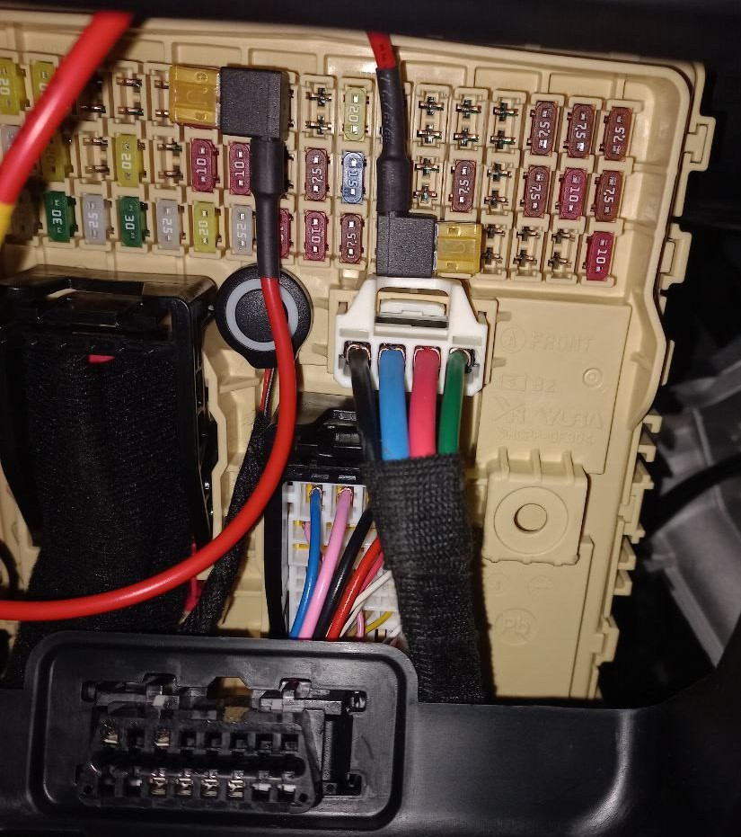

# Подключение видеорегистратора

## Что потребуется

1. Видеорегистратор
2. Разветвитель предохранителя (micro-2) - 2 шт. (если подключаете видеорегистратор с автономной записью, при заглушенном двигателе)
3. Кабель для подключения видеорегстратора

## Куда подключать

Обычно у видеорегистраторов с фиксацией событий при отключенном зажигании кабель состоит из 3 проводов:

- GND-(земля) - черный
- ACC(питание после запуска двигателя) - желтый
- VCC+(постоянное пистание) - красный

Схема подключения:

GND - на любой болт (землю)
VCC+ - Memory
ACC - Module2

/// caption
Сверху красный провод VCC+ подключен на Memory, снизу желтый ACC подключен к Module 2
///

/// caption
VCC - красный, ACC - желтый
///