# Аксессуары

!!! warning "Ссылки"
    Ссылки брались из сообщений в [Telegram-группе](https://t.me/Kia_Sportage_5_Turbo), поэтому приведены в информационных целях и не гарантируют оригинальность расходников и запчастей.

## Интерьер
### Коврики салона
| Производитель | Артикул | Ссылки | Комментарий |
|---|---|---| --- |
| Kia/Hyundai | KR4F14-AP825 | [ТГ](https://t.me/Kia_Sportage_5_Turbo/36159/117860)| |
| Kia/Hyundai |Коврики аля кожзам | KQ8F14-AP823 KQ8F14-AP824 | [Китайский авито](https://www.goofish.com/item?id=722962353965&spm=widle.12011849.copy.detail&ut_sk=1.aNgDOkObNiwDAOTkA3Z43seu_12431167_1759001764406.copy.detail.722962353965.2220879045763) | Нет уверенности в том, что подойдут |
| Kia/Hyundai | Коврики аля кожзам | KCKF14-AP825   KCKF14-AP827 | [Китайский авито](https://www.goofish.com/item?id=701640020778&spm=widle.12011849.copy.detail&ut_sk=1.aNgDOkObNiwDAOTkA3Z43seu_12431167_1759001764406.copy.detail.701640020778.2220879045763) ||
| Kia/Hyundai |Коврики резиновые | KCKF14-AP828|||
| Delform | EVS-0611 | [Ozon 1](https://ozon.ru/t/g2U420E) [Ozon 2](https://ozon.ru/t/QogFtO4) | Подходят от Tucson с доработкой: установить универсальное крепление и сделать вырез под рычаг лючка бензобака |
| SRTK | - | [Ozon](https://ozon.ru/t/JT64ECa) | Резиновые (требуется подрезка 5-10 мм в области рычага открытия лючка бензобака). Есть жалобы на запах, но он уходит после 1-2 моек |
| NoName |- |[Ozon](https://ozon.ru/t/tk19aVu) | Ворсовые |
| NoName | - | [Ozon](https://ozon.ru/t/h1FAkwN) | EVA-ковры с бортом |

??? info "Delform"
    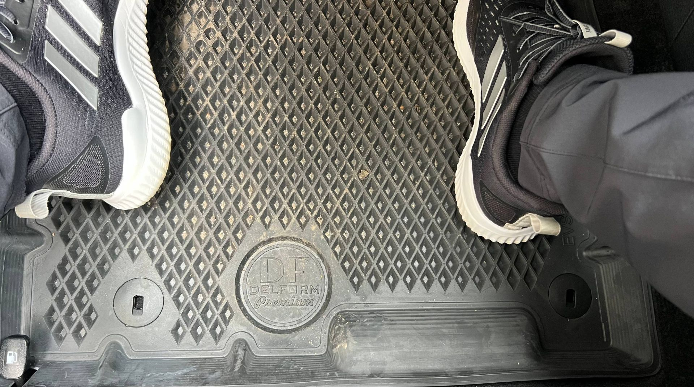{ loading=lazy }

??? info "SRTK резиновые"
    { loading=lazy }
    { loading=lazy }
    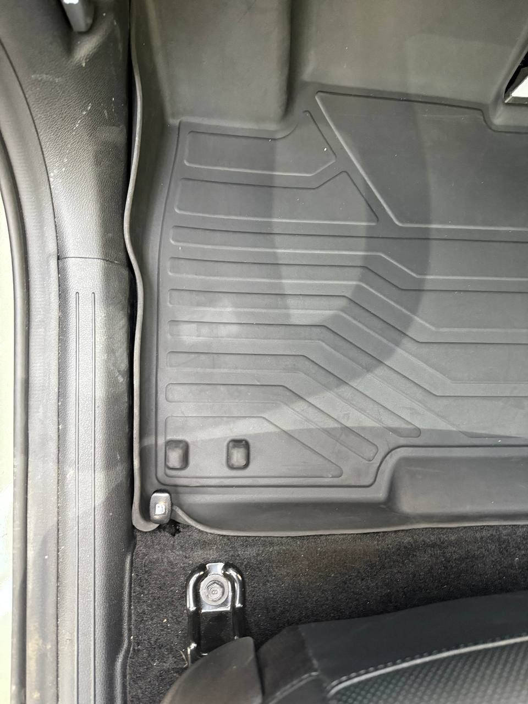{ loading=lazy }

??? info "Фото KQ8F14-AP823"
    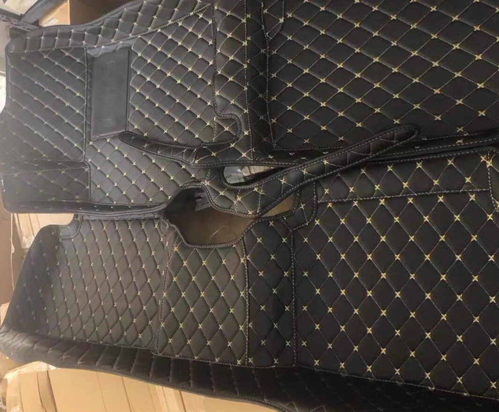{ loading=lazy }
    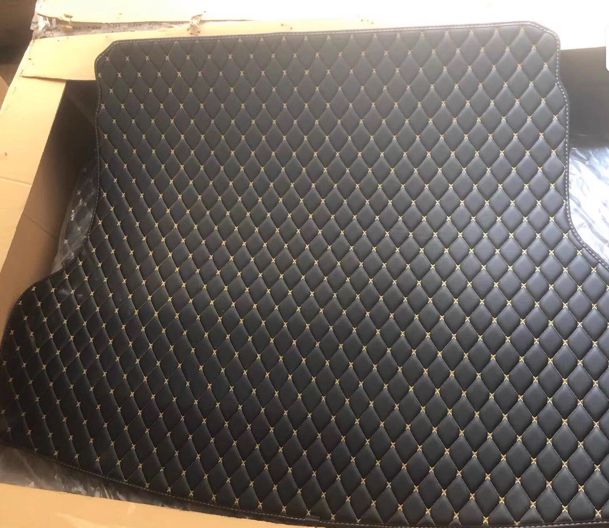{ loading=lazy }
    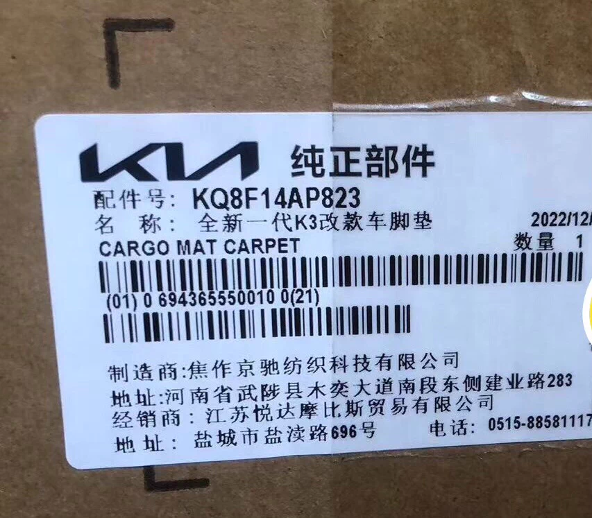{ loading=lazy }
    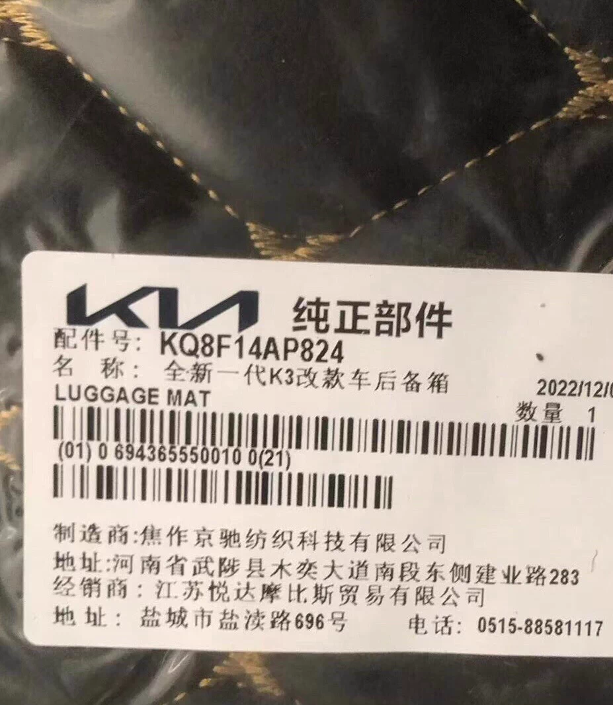{ loading=lazy }
    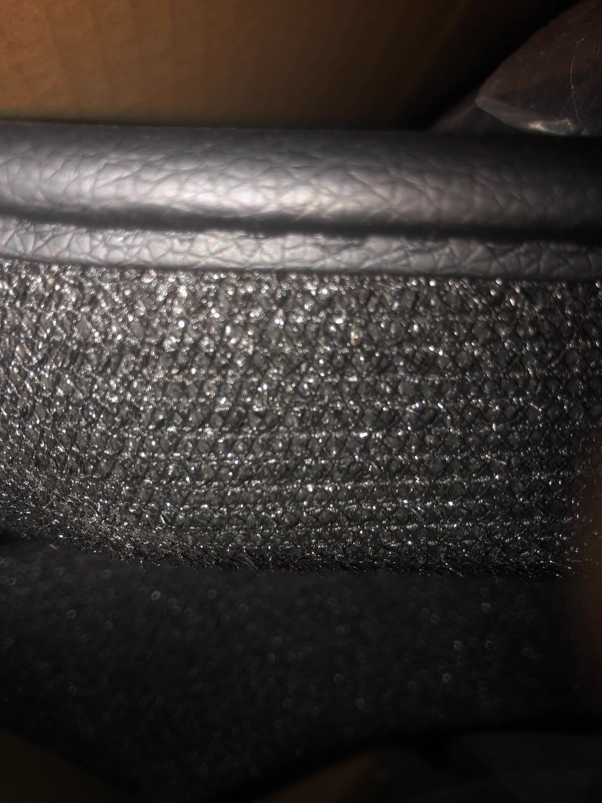{ loading=lazy }

??? info "Фото KCKF14-AP825"
    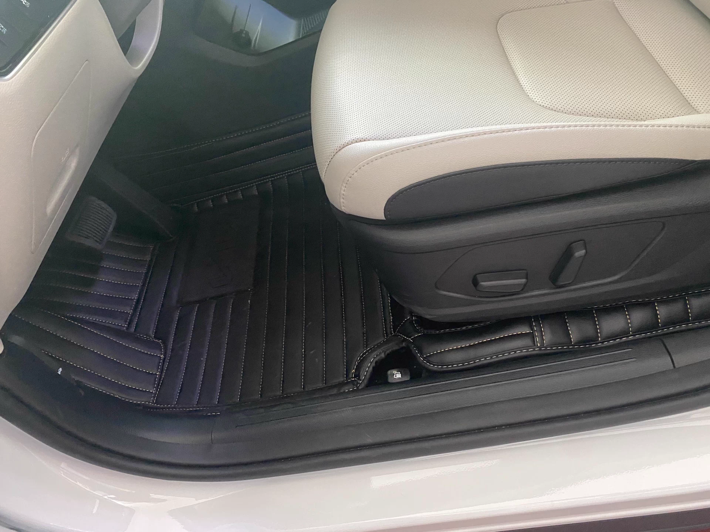{ loading=lazy }
    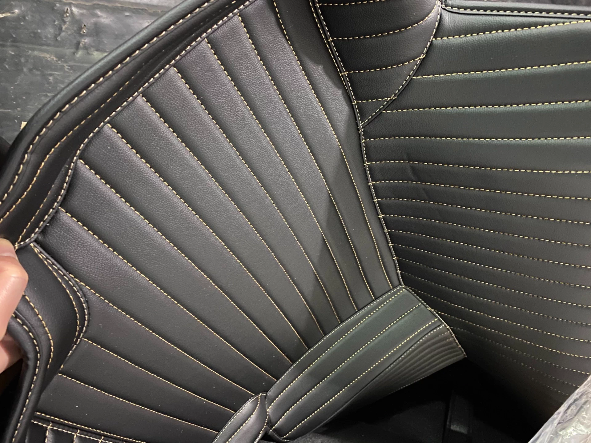{ loading=lazy }
    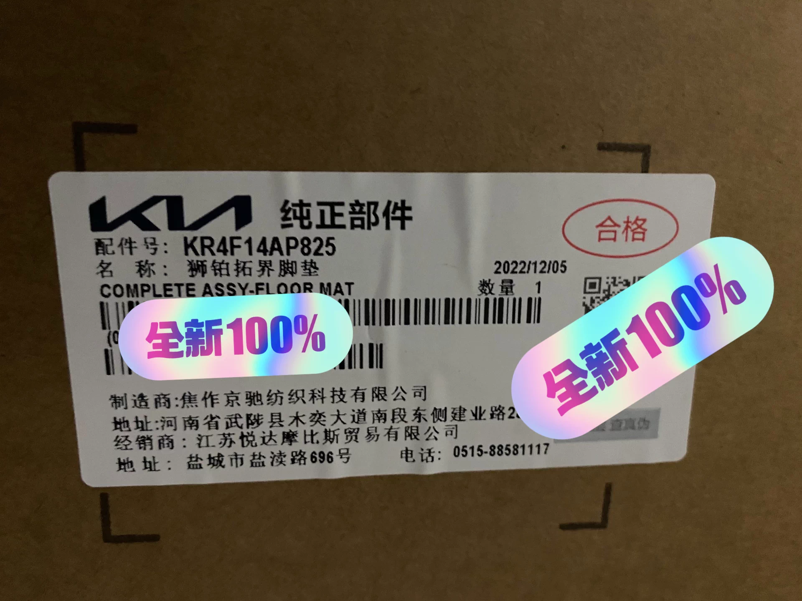{ loading=lazy }
    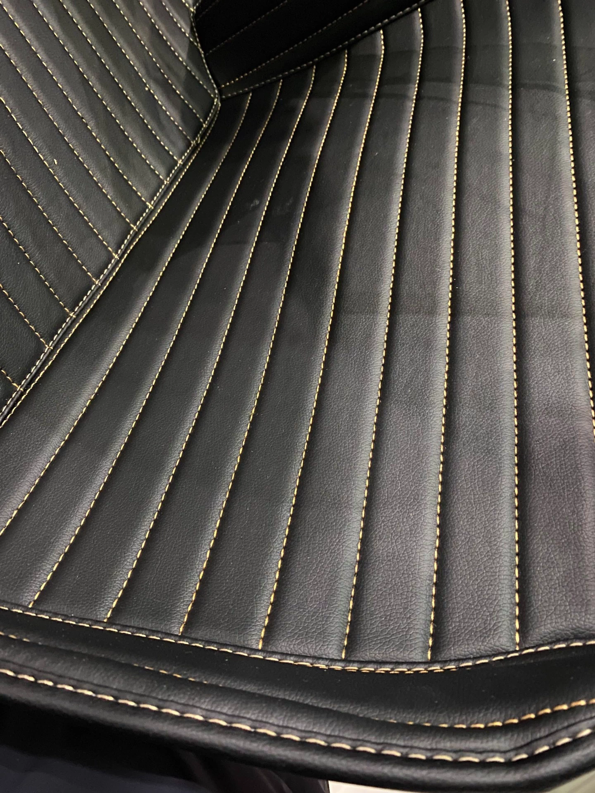{ loading=lazy }
    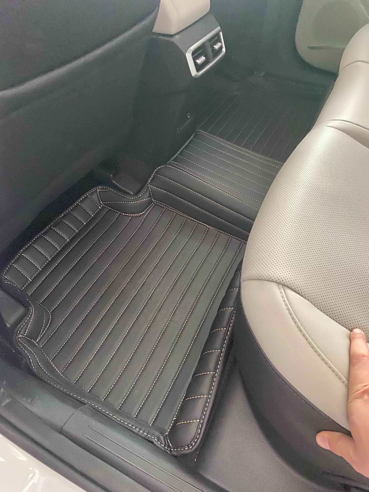{ loading=lazy }
    { loading=lazy }

### Крепление для ковриков

[WB](https://www.wildberries.ru/catalog/250658965/detail.aspx?targetUrl=SN)

### Коврик в багажник

У нас вариант с сабом

|Наименование | Производитель | Артикул | Ссылки |
|---|---|---|---|
|Коврик резиновый | Kia/Hyundai | KCKF14-AP828 ||
| Коврик багажного отсека (ворс) |Kia/Hyundai | R8570P-1100WK | [Оф.сайт Kia.ru](https://www.kia.ru/service/accessories/R8570P1100WK/) |
| Коврик багажного отсека (резиновый) |Kia/Hyundai | R8570-P1100 | [Оф.сайт Kia.ru](https://www.kia.ru/service/accessories/R8570P1100/) |
| Коврик багажного отсека (резиновый) | Element | | [С сабом - Ozon](https://ozon.ru/t/7i1J2Yy) |
| Коврик багажного отсека (резиновый) | Mile | | [Ozon](https://www.ozon.ru/product/kovrik-v-bagazhnik-3d-kia-sportage-5-komplektatsiya-s-sabvuferom-2022-2025-kovriki-avtomobilnye-kia-699697483/?from=share_ios&perehod=smm_share_button_productpage_link) |

### Сетка в багажник

- [Сетка 60х90](https://ozon.ru/t/tkPaOAG)

### Органайзер в подлокотник
- [Ozon](https://ozon.ru/t/LteZYjq)

### Накладки на рейлинги передних сидений

- [Ozon](https://ozon.ru/t/dQWSUfO)

## Защиты
### Защита двигателя

| Производитель | Артикул   | Ссылки | Комментарий |
|---|---|---| --- |
| Rival | 111.2862.1  | [Ozon](https://ozon.ru/t/IFxPFuR) | Иногда вместо Rival приходят оригиналы от Kia |

### Защита заднего редуктора

| Производитель | Артикул   | Ссылки |
|---|---|---|
| Rival | 111.2390.1  | [Ozon](https://ozon.ru/t/7iJyfPV) |

### Защита бензобака
| Производитель | Артикул   | Ссылки | Комментарий |
|---|---|---| --- |
| Rival | 111.2862.1  | [Ozon](https://ozon.ru/t/g2Pvyf4) | **Не подходит один кронштейн для крепления - надо колхозить. Сама защита по форме бака подходит.** |

## Газовые упоры капота
| Производитель | Артикул   | Ссылки | Комментарий |
|---|---|---| --- |
| Китай | - | [Aliexpress](https://aliexpress.ru/item/1005005270062965.html)| [Пример установки](https://t.me/Kia_Sportage_5_Turbo/36156/109038)
| Автоупор | UHYTUC021 | [Ozon](https://www.ozon.ru/product/amortizator-kapota-2-sht-dlya-henday-tukson-4-kia-sporteydzh-5-art-uhytuc021-avtoupor-2890131247/) | [Пример установки](https://t.me/Kia_Sportage_5_Turbo/36159/148431) |

!!! warning "При установке не подходящих упоров может возникнуть щель между кузовом и капотом"

## Номерные рамки

 - [Ozon 1](https://ozon.ru/t/baJ7nXE)
 - [Ozon 2](https://ozon.ru/t/QoGQZ8S)

## Держатель для телефона

- [Aliexpress](https://sl.aliexpress.ru/p?key=LXPhV9R)

## Обманка старт/стоп

[Aliexpress](https://sl.aliexpress.ru/p?key=VcrqVPr) - нужна версия 2022-2024, не ошибитесь при заказе!

## Пленка для защиты элементов салона и экранов

[Aliexpress](https://aliexpress.ru/item/1005008562646656.html)
[Ozon](https://ozon.ru/t/l7W6k2H)

## Защита разъема в двери

[Avito](https://www.avito.ru/lobnya/zapchasti_i_aksessuary/zaschita_razema_dveri_kia_hyundai_1976717512?utm_campaign=native&utm_medium=item_page_android&utm_source=soc_sharing)

## Щетки

### Щетки стеклоочистителя - дворники (размеры 600/400)

Идеальный размер по отзывам -  650/400 (при использовании поводков от Казахской сборки)

| Описание | Производитель | Артикул | Ссылки | Комментарий|
|---|---|---|---| --- |
| Левая щетка | Kia/Hyundai | 98350-R4000 | | |
| Правая щетка | Kia/Hyundai | 98360-R4000| | |
| Задний дворник | Kia/Hyundai | 98850-P2000 | | **информация не проверена** |
| Резинка левая |  Kia/Hyundai | GSF03B-600 | | | 
| Резинска правая |Kia/Hyundai | GSF03B-400 | | |
| Комплект (левая + правая) | LNJING | без номера | [Aliexpress](https://ali.click/vk9mo1) | [Пример работы](https://t.me/Kia_Sportage_5_Turbo/36156/143835) **Обратите внимание, нужен вариант LHD - Left Hand Drive** |
| Комплект (левая + правая) 600/450 | OSAWA | F88-24 + 18 | [Ozon](https://ozon.ru/t/A0m4jV6)| Могут продаваться и по отдельности (Osawa F88-24 и Osawa F88-18). Правый 450мм, немного задевает в нижнем положении - [видеодемонстрация](https://t.me/Kia_Sportage_5_Turbo/36159/117977?single). Также есть жалобы, что скрипят и полосят сразу после установки |
| Комплект (леавя + правая) 600/450 | X-TEC | XC24-KH + XC18-KH | [2dvornika](https://2dvornika.ru/kia/kia_sportage/18527.html) | **Еще не протестированы!** |
| Комплект (левая + правая) 600/450 | NoName | F-61-24-18 | [Aliexpress](https://ali.click/uk8mow)| **Еще не протестированы!** |

### Переходники для дворников
| Производитель | Артикул   | Ссылки |
|---|---|---|
| NoName | B20  | [Aliexpress](https://aliexpress.ru/item/1005006533195225.html) |
| Fukoku |FA17 | |

С данными переходниками можно использовать любые дворники с креплением "крючок", например:

- [RD5](https://ozon.ru/t/hwS3LqL)
- [Double Force](https://ozon.ru/t/Ev21jRa)
- [NoName](https://ozon.ru/t/7oZdUWT)
- [WBF](https://ozon.ru/t/fcTohAP)
- [Zekkert AR653S](https://ozon.ru/t/L4wOfh6)
- [Zekkert HW6001/HW4001](https://ozon.ru/t/Ec8dp8J)

и множество других на ваш выбор c съемным креплением

??? info "Zekkert HW6001/HW4001"
    { loading=lazy }
    { loading=lazy }
    { loading=lazy }

    [Видео работы](https://t.me/Kia_Sportage_5_Turbo/36159/147585)
    
### Резинки дворников 

**Формат резинок:** Bosch

[Wildberries](https://www.wildberries.ru/catalog/101002563/detail.aspx?targetUrl=SN)

[ALCA - Ozon](https://ozon.ru/t/fA2pyCG)

[Akita - Ozon](https://ozon.ru/t/jhA0qot)

[Резинки для дворников Osawa](https://ozon.ru/t/1GVX4RY)

!!! info "[Инструкция по смене резинок](../service/manuals/smena_rezinok.md)"

## Поводки дворников (Казах)

| Производитель | Артикул |
|---|---|
| Kia/Hyundai | 98311P-1000 (левый) |
| Kia/Hyundai | 98321P-1000 (правый) |

## Клипсы
### Клипсы пластиковые для защиты и бампера

| Описание | Производитель | Артикул | Ссылки |
|---|---|---|---|
| Клипсы защита двигателя и в бампер|  Kia/Hyundai | 142060-8250B | [Аналог на Ozon](https://ozon.ru/t/quj5Z21) |

### Клипсы для подкрылков

| Описание | Производитель | Артикул | Альтернтаива |
|---|---|---| --- |
| Клипса подкрылка | Kia/Hyundai | 142060-8250B | [Ozon](https://ozon.ru/t/quj5Z21) |
| Клипса подкрылка сборная (первая часть) | Kia/Hyundai | 142070-6180N ||
| Клипса подкрылка сборная (вторая часть) | Kia/Hyundai | 142070-6130M ||

### Клипсы для интерьера
| Описание | Производитель | Артикул |
|---|---|---| 
| Клипсы крепления обшивки багажника | Kia/Hyundai | 82315-2P000 |
| Фиксатор (пистон) обшивки передних дверей | Kia/Hyundai | 82315-L0000 |

### Клипсы уплотнителей двери и низа кузова

| Описание | Производитель | Артикул |
|---|---|---| 
| Клипса | Kia/Hyundai | 87715-D2000 |
| Клипса | Kia/Hyundai | 87758-G2000 |
| Клипса | Kia/Hyundai | 84747-2L000 |
| Клипса | Kia/Hyundai | 87716-2W000 |
| Болт | Kia/Hyundai | 124310-3107B |
