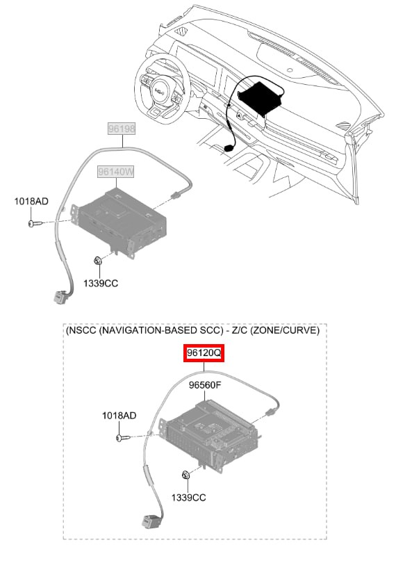

# Электрика

!!! warning "Ссылки"
    Ссылки брались из сообщений в [Telegram-группе](https://t.me/Kia_Sportage_5_Turbo), поэтому приведены в информационных целях и не гарантируют оригинальность расходников и запчастей.

## Разъемы блока ЭБУ
| Производитель | Артикул   |
|---|---|
| Kia/Hyundai | 206308-1222 |
| Kia/Hyundai | 206308-1123 |
| Kia/Hyundai | 206308-0550 |

??? info "Фото 206308-1123"
    { loading=lazy }
    { loading=lazy }
    { loading=lazy }

??? info "Фото 206308-0550"
    { loading=lazy }
    { loading=lazy }
    { loading=lazy }
    { loading=lazy }
    
??? info "Фото 206308-1222"
    { loading=lazy }

## Разъемы USB

| Наименование | Производитель | Артикул |
|---|---|---|
| Разъем USB | Kia/Hyundai | 96120-R4000 |
| Проводка Type-C | Kia/Hyundai | 84624-R4000 |
| Разъем Type-C | Kia/Hyundai | 96125-R4000 |

??? info "Схема для Разъема USB 96120-R4000"
    { loading=lazy }

??? info "Схема для проводки Type-C (84624-R4000 и 96125-R4000)"
    { loading=lazy }

## Панель фар и открытия багажника

| Производитель | Артикул   |
|---|---|
| Kia/Hyundai | 93700-R4100 |

??? info "Фото"
    { loading=lazy }
    { loading=lazy }

## Панель климата

| Наименование | Артикул | Ссылка |
| --- | --- | --- |
|Панель с КПП и с подогревом и вентиляцией (Premium и Flagship) | 97250-R4100 | [Aliexpress](https://sl.aliexpress.ru/p?key=wTegVGx)
|Панель с КПП без подогрева (Luxury)| 97250-R4000 |

## Обманка старт/стоп

[Aliexpress](https://sl.aliexpress.ru/p?key=VcrqVPr)

## Лампочка в багажник

??? info "Типоразмер T11 C5W 31mm 1шт"

- [Ozon](https://ozon.ru/t/1Gvbu80)
- [Aliexpress](https://sl.aliexpress.ru/p?key=aDyhVEr)

## Лампочки под задний номер

??? info "Типоразмер T10 W5W 2 шт"

- [Ozon](https://ozon.ru/t/quCQgR7)
- [Aliexpress](https://sl.aliexpress.ru/p?key=wnyhVYb)

## Крышка минусовой клемы АКБ

| Артикул | Ссылка |
|---|---|
|37113-C5100| [Ozon](https://ozon.ru/t/390gOkE)

## Блок ЭБУ

| Производитель | Артикул   |
|---|---|
| Kia/Hyundai | 39110-2J892 |

??? info "Фото"
    { loading=lazy }
