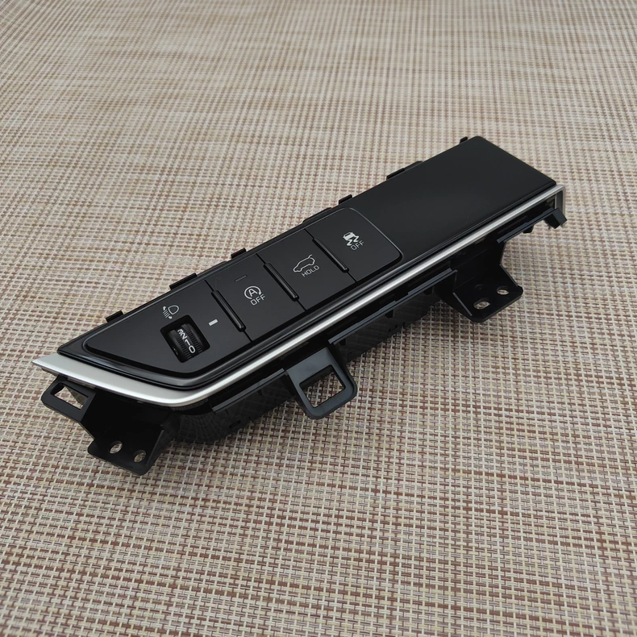

# Интерьер

!!! warning "Ссылки"
    Ссылки брались из сообщений в [Telegram-группе](https://t.me/Kia_Sportage_5_Turbo), поэтому приведены в информационных целях и не гарантируют оригинальность расходников и запчастей.

## Панель климата

| Наименование | Артикул | Ссылка |
| --- | --- | --- |
|Панель с КПП и с подогревом и вентиляцией (Premium и Flagship) | 97250-R4100 | [Aliexpress](https://sl.aliexpress.ru/p?key=wTegVGx)
|Панель с КПП без подогрева (Luxury)| 97250-R4000 |

## Панель фар и открытия багажника

| Производитель | Артикул   |
|---|---|
| Kia/Hyundai | 93700-R4100 |

??? info "Фото"
    { loading=lazy }
    { loading=lazy }

## Подсветка салона
| Производитель | Артикул |
| --- | --- |
| Kia/Hyundai | KR4F39-AP833 |

??? info "Фото"
    { loading=lazy }
    { loading=lazy }
    { loading=lazy }
    { loading=lazy }
    { loading=lazy }
    { loading=lazy }

## Демпфер багажника
| Артикул | Ссылка | Комментарий |
| --- | --- | --- |
| 81738-1J000 | [Ozon](https://ozon.ru/t/tkNfrio) | Не родной! Длинее родного и поэтому дает больше возможности для регулировки |

## Обшивка передней двери

| Наименование | Артикул |
| --- | --- | 
| Фиксатор (пистон) обшивки дверей | 82315-L0000 |
| Заглушка на болты в обшивке передних дверей | 82715-R400 | 
| Пластиковая панель с ручкой и регулировкой сидений на передней левой двери | 82331-R4030 |
| Блок кнопок управления сидениями | 93250-R4000 |
| Ручка левой передней двери салона | 82610-R4010 |
| Блок управления стеклоподъёмниками |  93571-R4400 |

??? info "Фото"
    { loafing=lazy}
    /// caption
    Фиксатор (пистон) обшивки дверей - 82315-L0000
    ///
    
    { loafing=lazy}
    /// caption
    Заглушка на болты в обшивке передних дверей - 82715-R400
    ///

    { loafing=lazy}
    /// caption
    Пластиковая панель с ручкой и регулировкой сидений на передней левой двери - 82331-R4030
    ///

    { loafing=lazy}
    /// caption
    Блок кнопок управления сидениями - 93250-R4000
    ///    

    { loafing=lazy}
    /// caption
    Ручка левой передней двери салона - 82610-R4010
    ///    

    { loafing=lazy}
    /// caption
    Блок управления стеклоподъёмниками - 93571-R4400
    ///        