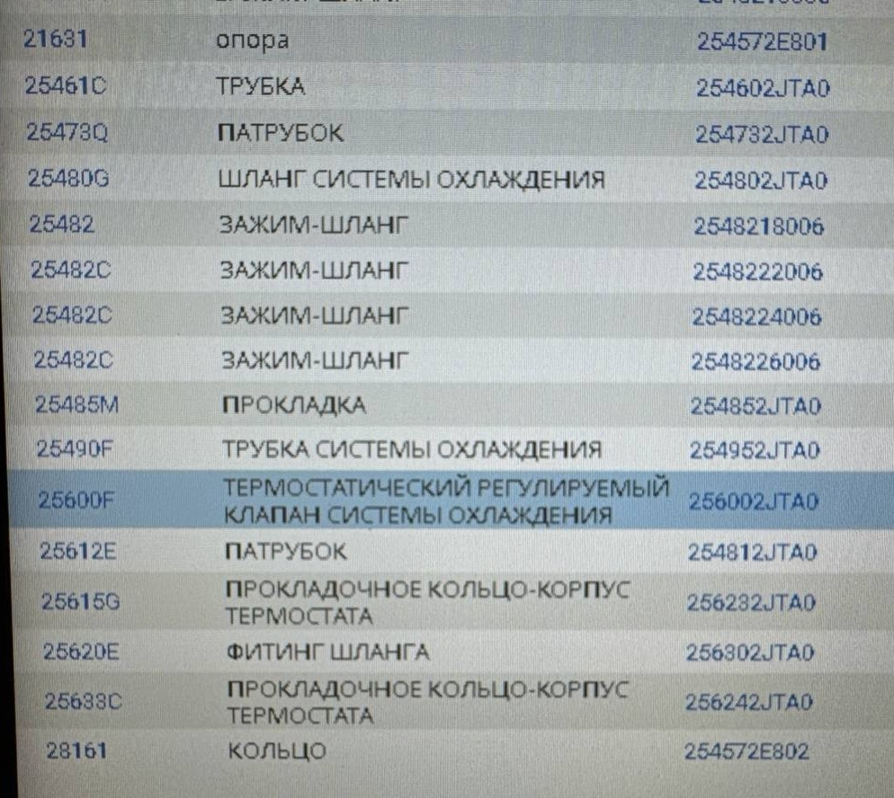
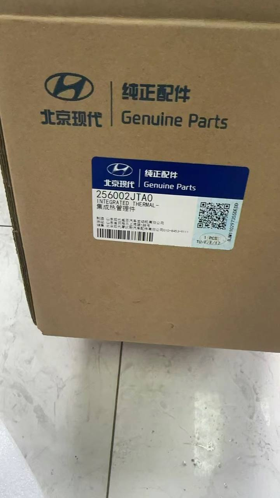
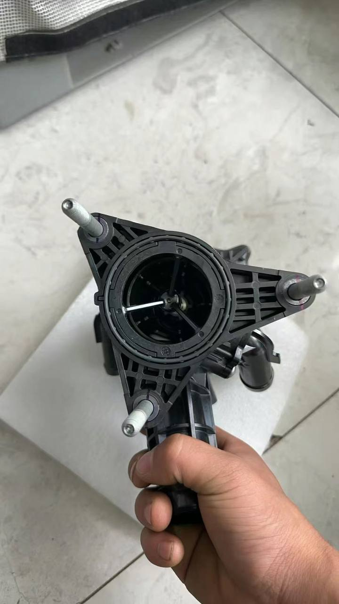
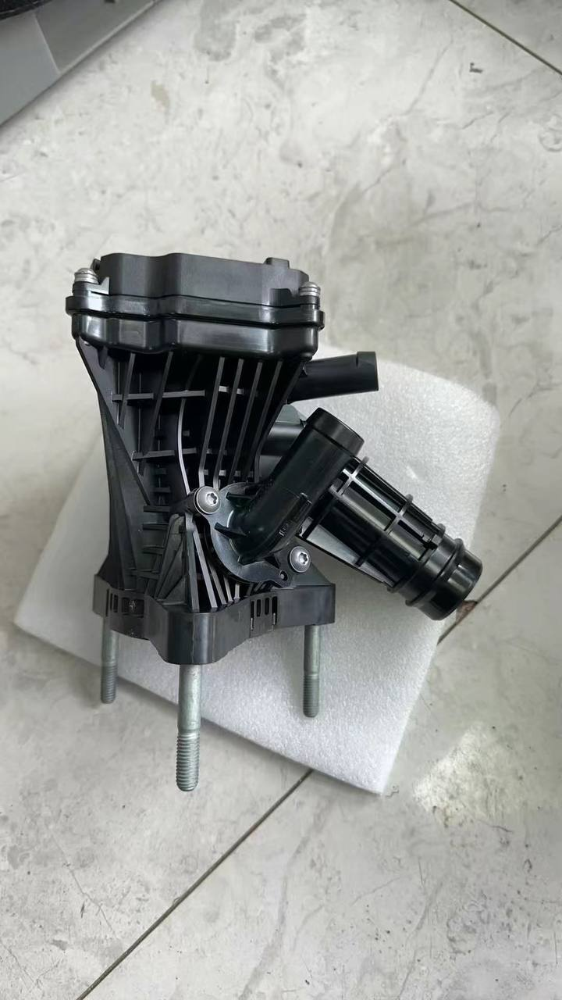

# Двигатель и трансмиссия

!!! warning "Ссылки"
    Ссылки брались из сообщений в [Telegram-группе](https://t.me/Kia_Sportage_5_Turbo), поэтому приведены в информационных целях и не гарантируют оригинальность расходников и запчастей.

## Свечи
### 2.0T
| Производитель | Артикул | Комментарий |
|---|---| --- |
| Kia/Hyundai | 18878-08115 ||
| Kia/Hyundai | 18878-09115 ||
| NGK | SILZKR8H9G | |
| NGK | SILZKR8E9G | была замена на SILZKR8H9G см. ниже |

??? info "Замена NGK SILZKR8E9G на SILZKR8H9G"
    Был бюллетень по замене SILZKR8E9G на SILZKR8H9G
    { loading=lazy }

### 1.5T
| Производитель | Артикул |
|---|---|
| Kia/Hyundai | 18875-08085 |
| NGK | SILZKR8J8GS |
| MOUSSON | SSPG4FS |

## Катушка зажигания
### 2.0T
| Производитель | Артикул   |
|---|---|
| Kia/Hyundai | 27300-2JTD0 |

### 1.5T
| Производитель | Артикул   |
|---|---|
| Kia/Hyundai | 27301-2M417 |

## Комплект ГРМ
### 2.0T
| Наименование | Производитель | Артикул  |
|---|---|---|
 | Цепь ГРМ | Kia/Hyundai | 24321-2JTA0 |
 | Направляющий распредвала для цепи привода ГРМ | Kia/Hyundai | 24440-2JTA0 |
 | Направляющая цепи привода ГРМ | Kia/Hyundai | 24420-2JTA0 |
 | Передний успокоитель | Kia/Hyundai | 24430-2J000 |
 | Звездочка коленвала | Kia/Hyundai | 23121-2JTB0 |
 | Натяжитель ремня ГРМ | Kia/Hyundai | 24410-2JTA2 |

### 1.5T
| Наименование | Производитель | Артикул |
|---|---|---|
| Цепь ГРМ | Kia/Hyundai | 24321-2M800 |
| Передний успокоитель | Kia/Hyundai | 24431-2M010 |
| Звездочка коленвала | Kia/Hyundai | 23121-2M810 |
| Натяжитель ремня ГРМ | Kia/Hyundai | 24410-2M803 |

## Маслонасос
### 2.0T
| Производитель | Артикул | Комментарий |
|---|---|---|
| Kia/Hyundai | 21300-2JTA1 | [Источник](https://t.me/Kia_Sportage_5_Turbo/36156/116653) |

### 1.5T
| Производитель | Артикул | Комментарий |
|---|---|---|
| Kia/Hyundai | 21310-2M800 |  |
| MOUSSON | SOPG4FSII |  |

## Радиатор АКПП

| Производитель | Артикул | Комментарий |
|---|---|---|
| Hayden | OC-698 | [Пример 1](https://t.me/Kia_Sportage_5_Turbo/36156/110035)   [Пример 2](https://t.me/Kia_Sportage_5_Turbo/36161/112475) |

## Пробка заливная раздаточной коробки
### 2.0T
| Производитель | Артикул   | Ссылка |
|---|---|---|
| Kia/Hyundai | 47355-3900 | [Wildberries](https://www.wildberries.ru/catalog/257998298/detail.aspx) |

## Помпа
### 2.0T
| Наименование | Производитель | Артикул |
|---|---|---|
| Помпа (насос) охлаждающей жидкости | Kia/Hyundai | 25100-2J100 |
| Прокладка под помпу | Kia/Hyundai | 25124-2J100 |
| Шкив | Kia/Hyundai | 25221-2JTA1 |

## Приводной ремень
### 2.0T
| Производитель | Артикул | Комментарий |
|---|---| --- |
| Kia/Hyundai | 25212-2JTB0 | 6PK 1583 |

## Клапан EGR
### 2.0T
| Производитель | Артикул | 
|---|---|
| Kia/Hyundai | 28400-2JTC3 |

## Термостат и система охлаждения
### 2.0T

??? info "Схемы"
    { loading=lazy }
    { loading=lazy }
    { loading=lazy }
    /// caption
    С этой фотографии парт-номера не переведены в таблицу
    ///

??? info "Фотографии термостата"
    { loading=lazy, allign=left }
    { loading=lazy, allign=right}
    { loading=lazy, allign=left}
    { loading=lazy, allign=right}

| Наименование | Производитель | Артикул | 
|--- |---|---|
| Термостат| Kia/Hyundai | 25600-2JTA0 |
| Опора | Kia/Hyundai | 25457-2E801 |
| Трубка | Kia/Hyundai | 25460-2JTA0 |
| Патрубок | Kia/Hyundai | 25473-2JTA0 |
| Шланг системы охлаждения | Kia/Hyundai | 25480-2JTA0 |
| Зажим-шланг | Kia/Hyundai | 25482-18006 |
| Зажим-шланг | Kia/Hyundai | 25482-22006 |
| Зажим-шланг | Kia/Hyundai | 25482-24006 |
| Зажим-шланг | Kia/Hyundai | 25482-26006 |
| Прокладка | Kia/Hyundai | 25485-2JTA0 |
| Трубка системы охлаждения | Kia/Hyundai | 25495-2JTA0 |
| Патрубок | Kia/Hyundai | 25481-2JTA0 |
| Прокладочное кольцо-корпус термостата | Kia/Hyundai | 25623-2JTA0 |
| Фитинг шланга | Kia/Hyundai | 25630-2JTA0 |
| Прокладочное кольцо-корпус термостата | Kia/Hyundai | 25624-2JTA0 |
| Кольцо | Kia/Hyundai | 25457-2E802 |

## Пыльник картера

| Наименование | Производитель | Артикул | Ссылки |
|--- |---|---|---|
| Пыльник картера (пластиковый) | Kia/Hyundai | 29110-R4000 | [Aliexpress](https://aliexpress.ru/item/1005007798386346.html)|

??? info "Фото пыльника 29110-R4000"
    { loading=lazy }
    { loading=lazy }
    { loading=lazy }
    { loading=lazy }
    { loading=lazy }
    { loading=lazy }

## Турбонагнетатель (турбина)

??? info "Схема"
    { loading=lazy }