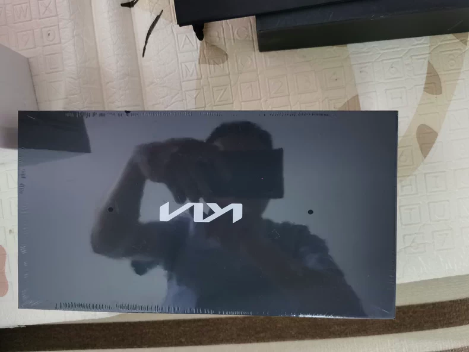

# Прочее

!!! warning "Ссылки"
    Ссылки брались из сообщений в [Telegram-группе](https://t.me/Kia_Sportage_5_Turbo), поэтому приведены в информационных целях и не гарантируют оригинальность расходников и запчастей.

## Щетки очистителя (размеры 600/400)

Идеальный размер по отзывам -  650/400 (при использовании поводков от Казахской сборки)

| Производитель | Артикул | Ссылки | Комментарий|
|---|---|---| --- |
| Kia/Hyundai | 98350-R4000 | | левая щетка |
| Kia/Hyundai | 98360-R4000| | правая щетка |
| Kia/Hyundai | GSF03B-600 | | резинка левая | 
| Kia/Hyundai | GSF03B-400 | | резинка правая |
| LNJING | без номера | [Aliexpress](https://aliexpress.ru/item/1005009068323895.html) | |
|RD5| без номера |[Ozon](https://ozon.ru/t/h1orqeG)| Щетки RD5 должны использоваться с [переходником B20](./accessories.md#_8)|
| OSAWA | F88-24 + 18 | [Ozon](https://ozon.ru/t/A0m4jV6)| Могут продаваться и по отдельности (Osawa F88-24 и Osawa F88-18). Правый 450мм, немного задевает в нижнем положении - [видеодемонстрация](https://t.me/Kia_Sportage_5_Turbo/36159/117977?single) |

## Поводки дворников (Казахстанская версия с крючком)

| Производитель | Артикул |
|---|---|
| Kia/Hyundai | 98311-P1000 |
| Kia/Hyundai | 98321-P1000 |

## Переходники для дворников
| Производитель | Артикул   | Ссылки |
|---|---|---|
| NoName | B20  | [Aliexpress](https://aliexpress.ru/item/1005006533195225.html) |
| Fukoku |FA17 | |

С данными переходниками можно использовать любые дворники с креплением "крючок", например:
[RD5](https://ozon.ru/t/hwS3LqL)
[Double Force](https://ozon.ru/t/Ev21jRa)
[NoName](https://ozon.ru/t/7oZdUWT)
[WBF](https://ozon.ru/t/fcTohAP)
[Zekkert AR653S](https://ozon.ru/t/L4wOfh6)
[Masuma MU-16G + MU-26G](https://ozon.ru/t/Bx5Mo3u)

и множество других на ваш выбор

## Клипсы
### Клипсы пластиковые для защиты и бампера

| Описание | Производитель | Артикул |
|---|---|---| 
| Клипсы защита двигателя и в бампер|  Kia/Hyundai | 142060-8250B |

### Клипсы для подкрылков

| Описание | Производитель | Артикул | Альтернтаива |
|---|---|---| --- |
| Клипса подкрылка | Kia/Hyundai | 142060-8250B | [Ozon](https://ozon.ru/t/quj5Z21) |
| Клипса подкрылка сборная (первая часть) | Kia/Hyundai | 142070-6180N ||
| Клипса подкрылка сборная (вторая часть) | Kia/Hyundai | 142070-6130M ||

### Клипсы для интерьера
| Описание | Производитель | Артикул |
|---|---|---| 
| Клипсы крепления обшивки багажника | Kia/Hyundai | 82315-2P000 |

### Клипсы уплотнителей двери и низа кузова

| Описание | Производитель | Артикул |
|---|---|---| 
| Клипса | Kia/Hyundai | 87715-D2000 |
| Клипса | Kia/Hyundai | 87758-G2000 |
| Клипса | Kia/Hyundai | 84747-2L000 |
| Клипса | Kia/Hyundai | 87716-2W000 |
| Болт | Kia/Hyundai | 124310-3107B |

## Подарочный набор

**Артикул** - KACF9-9AP688

??? info "Фото"
    { loading=lazy }
    { loading=lazy }
    { loading=lazy }

## Ароматизатор

| Производитель | Артикул |
|---|---|
| Kia/Hyundai | KACF99-AP758 |
| Kia/Hyundai | KACF99-AP830 |

??? info "Фото KACF99-AP758"
    { loading=lazy }
    { loading=lazy }
    { loading=lazy }
    { loading=lazy }
    { loading=lazy }

??? info "Фото KACF99-AP758"
    { loading=lazy }
    { loading=lazy }
