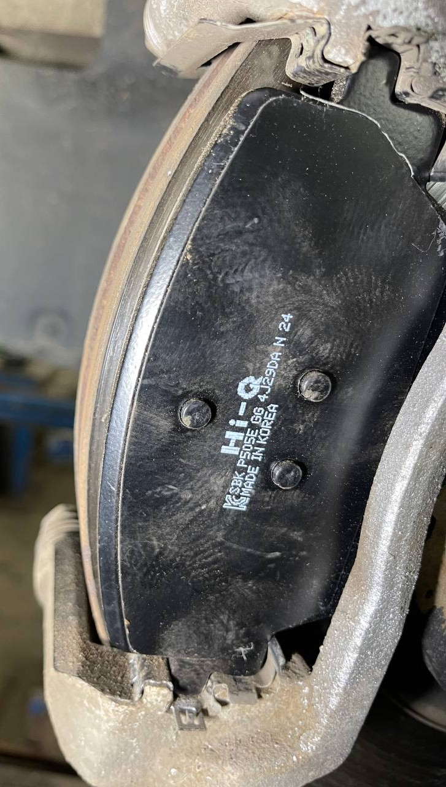

# Подвеска и тормозная система

!!! warning "Ссылки"
    Ссылки брались из сообщений в [Telegram-группе](https://t.me/Kia_Sportage_5_Turbo), поэтому приведены в информационных целях и не гарантируют оригинальность расходников и запчастей.

## Амортизаторы и пружины
### Задние
| Производитель | Артикул | Наименование |
|---|---| --- |
| Kia/Hyundai | 55307-R4000 | задний амортизатор |
| Kia/Hyundai | 55326-N9000 | отбойник |
| Kia/Hyundai | 55325-S9000 | пыльник |
| Kia/Hyundai | 55310-R4000 | опора амортизатора  |
| Kia/Hyundai | 55339-C5000 | чехол опоры |
| Kia/Hyundai | 55334-N9000 | накладка пружины |
| Kia/Hyundai | 55330-R4AC0 | накладка пружины |
| KYB | 3440062 | задний амортизатор|

## Тормозные колодки
### 2.0T
#### Передние колодки
| Производитель | Артикул | Комментарий |
|---|---|---|
| Kia/Hyundai | 58101-R4A10 |   |
| Kia/Hyundai | 58101-L6A10 | Не проверены ([Источник](https://www.jnbk-brakes.com/catalogue/cars/brake/81663485/PN6154))
| NIBK | PN6154 | Пока не проверены ([Источник](https://www.jnbk-brakes.com/catalogue/cars/brake/81663485/PN6154))|
| HI-Q / SANGSIN | SP4379 | Встают, но они уже и на край диска не ложатся - будет буртик оставаться + само ушко немного узкое в скобе суппорта болтаются |

??? info "NIBK PN6154"
    { loading=lazy }

??? info "HI-Q/Sangsin SP4379 - пример установки"
    { loading=lazy }
    { loading=lazy }
    { loading=lazy }
    { loading=lazy }

#### Задние колодки

| Производитель | Артикул | Комментарий |
|---|---|---|
| Kia/Hyundai | 58302-L6A15 |  |
| Kia/Hyundai | 58302-Q3A00 | Пока не проверены ([Источник](https://www.jnbk-brakes.com/catalogue/cars/brake/67570473/PN6146)) |
| Kia/Hyundai | 58302-L6A05 | Пока не проверены ([Источник](https://www.jnbk-brakes.com/catalogue/cars/brake/67570473/PN6146)) |
| Kia/Hyundai | 58302-R9A00 | Пока не проверены ([Источник](https://www.jnbk-brakes.com/catalogue/cars/brake/67570473/PN6146)) |
| Kia/Hyundai | 58302-G2A10 | Пока не проверены ([Источник](https://www.jnbk-brakes.com/catalogue/cars/brake/67570473/PN6146)) |
| Kia/Hyundai | 58302-F0A50 | Пока не проверены ([Источник](https://www.jnbk-brakes.com/catalogue/cars/brake/67570473/PN6146)) |
| Kia/Hyundai | 58302-AAA60 | Пока не проверены ([Источник](https://www.jnbk-brakes.com/catalogue/cars/brake/67570473/PN6146)) |
| Kia/Hyundai | 58302-AAA40 | Пока не проверены ([Источник](https://www.jnbk-brakes.com/catalogue/cars/brake/67570473/PN6146)) |
| HI-Q / SANGSIN | SP4462 | Пока не проверены ([Источник](https://www.jnbk-brakes.com/catalogue/cars/brake/67570473/PN6146)) |
| FMSI | D2373-9631 |Пока не проверены ([Источник](https://www.jnbk-brakes.com/catalogue/cars/brake/67570473/PN6146))|
| BENDIX AUS | DB2665 |Пока не проверены ([Источник](https://www.jnbk-brakes.com/catalogue/cars/brake/67570473/PN6146))|
| KASHIYAMA | D11505MH |Пока не проверены ([Источник](https://www.jnbk-brakes.com/catalogue/cars/brake/67570473/PN6146))|
| KASHIYAMA | D11505MH01 |Пока не проверены ([Источник](https://www.jnbk-brakes.com/catalogue/cars/brake/67570473/PN6146))|
| NIBK | PN6146 | Пока не проверены ([Источник](https://www.jnbk-brakes.com/catalogue/cars/brake/67570473/PN6146))|
| HI-Q / SANGSIN | SP4373 | На край диска не ложатся - будет буртик оставаться. По креплению подходят |

??? info "NIBK PN6146"
    { loading=lazy }

??? info "HI-Q/Sangsin SP4373 - пример установки"
    { loading=lazy }

### 1.5T
| Производитель | Артикул | Комментарий |
|---|---|---|
| Kia/Hyundai | 58101-R4A00 | передние  |
| Kia/Hyundai | 58302-L6A15 | задние |
| HI-Q / SANGSIN | SP4373 | задние, надо пробовать, информация может быть не точной |
| HI-Q / SANGSIN | SP4378 | Необходимо пробовать|

По артикулам задние колодки у 1.5Т аналогичны 2.0Т, можно пробовать ставить из списка выше

## Тормозные диски
### 2.0T
| Производитель | Артикул | Комментарий |
|---|---|---|
| Kia/Hyundai | 51712-R4100 | передний диск  |
| Kia/Hyundai | 58411-O3000 | задний диск  |
| Kia/Hyundai | 51712-P2000 | передний диск (от Sorento) подходят ещё 51712-P2700, 51712-R5000, 51712-R0050 [Пример установки](https://t.me/Kia_Sportage_5_Turbo/36156/101242?single) |

### 1.5T
| Производитель | Артикул | Комментарий |
|---|---|---|
| Kia/Hyundai | 51712-R4000 | передний диск, возможно подойдёт и 51712-L1000 или 51712-C2000 |
| Kia/Hyundai | 58411-O3000 | задний диск, возможно подойдёт 58411-L1100 |

## Ступицы

| Производитель | Артикул | Комментарий |
|---|---|---|
| Kia/Hyundai | 51730-L1000 | передняя ступица в сборе  |
| Kia/Hyundai | 52730-N9000 | задняя ступица в сборе  |

## Датчики давления в шинах

| Производитель | Артикул |
|---|---|
| Kia/Hyundai | 52940-O3100 |

!!! danger "Внимание"
    Датчик от Казахской версии (52940-L1100) **не подходит**!

## Диски
??? info "Характеристики"
    Для 18 диаметра (идёт с завода) параметры: R18 7.5J 5X114.3 ET 51 dia 67.1
    
    Для 19 диаметра (идёт для максимальной комплектации 2.0T): R19 7.5J 5X114.3 ET 51 dia 67.1

|Размер | Производитель | Артикул | Ссылки |
|---|---|---| --- |
| 19" | Kia/Hyundai | 52910-R4200 |
| 19" | Kia/Hyundai | 52910-R4260 |
| 19" | Kia/Hyundai | 52910-R4300 |
| 19" | Kia/Hyundai | 52910-L6930 |
| 19" | Kia/Hyundai | 52919-L6930 |
| 19" | Kia/Hyundai | 52960-Q2100 |
| 19" | Kia/Hyundai | 52910-P1310 | [Оф.сайт Kia.ru](https://www.kia.ru/service/accessories/52910P1310/) |
| 18" | Kia/Hyundai | 52910-P1210 | [Оф.сайт Kia.ru](https://www.kia.ru/service/accessories/52910P1210/) |
| 17" | Kia/Hyundai | 52910-P1110 | [Оф.сайт Kia.ru](https://www.kia.ru/service/accessories/52910P1110/) |

??? info "Изображение дисков"
    
{ loading=lazy }

### Клипсы и крепеж

| Наименование | Производитель | Артикул |
|---|---|---|
| Клипса подкрылка | Kia/Hyundai | 142060-8250B |
| Клипса подкрылка сборная (первая часть) | Kia/Hyundai | 142070-6180N |
| Клипса подкрылка сборная (вторая часть) | Kia/Hyundai | 142070-6130M |

