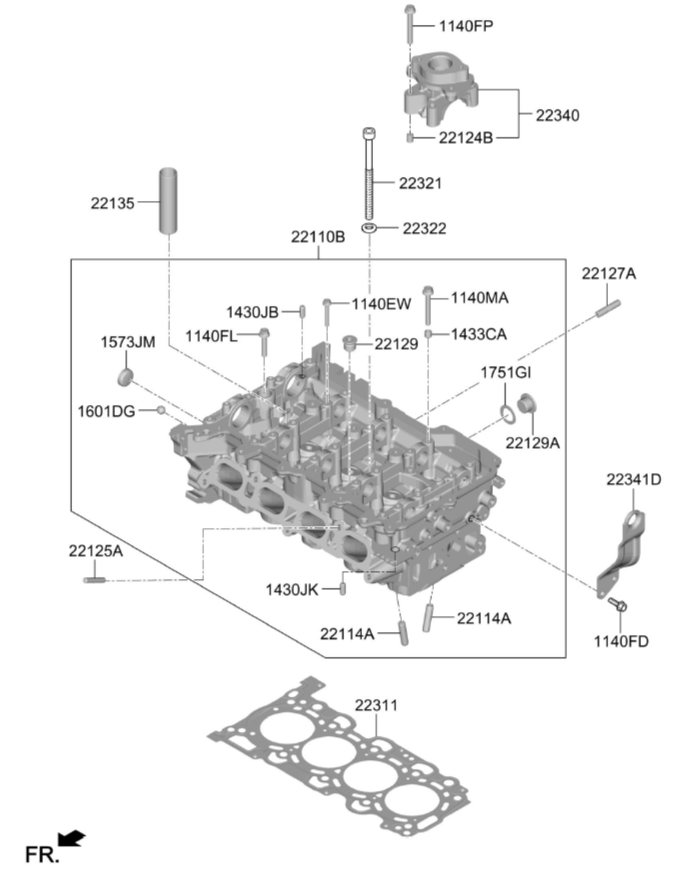
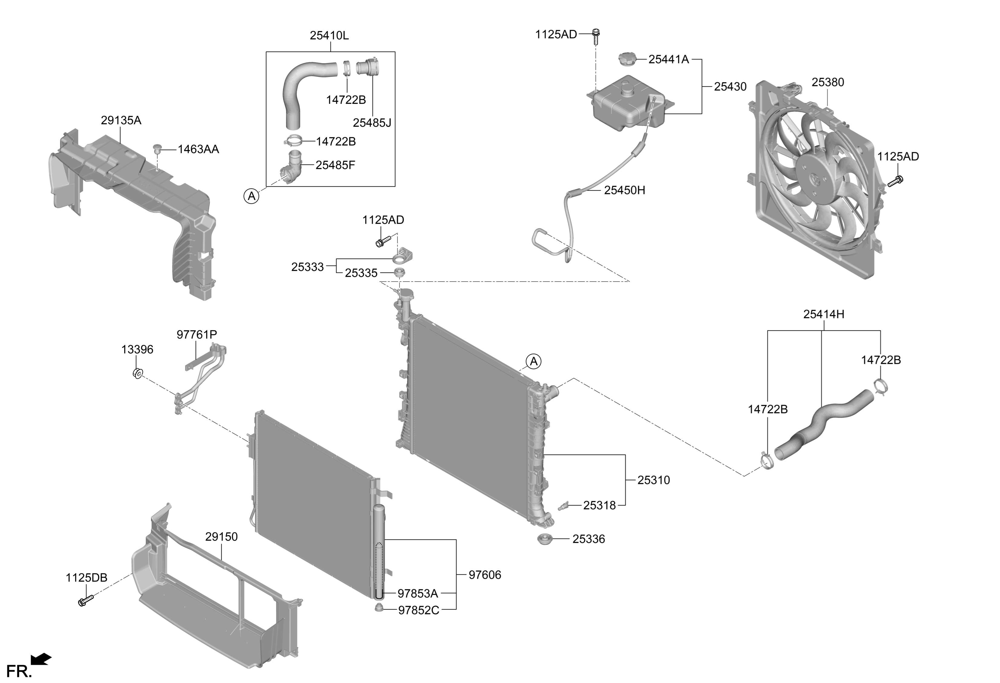
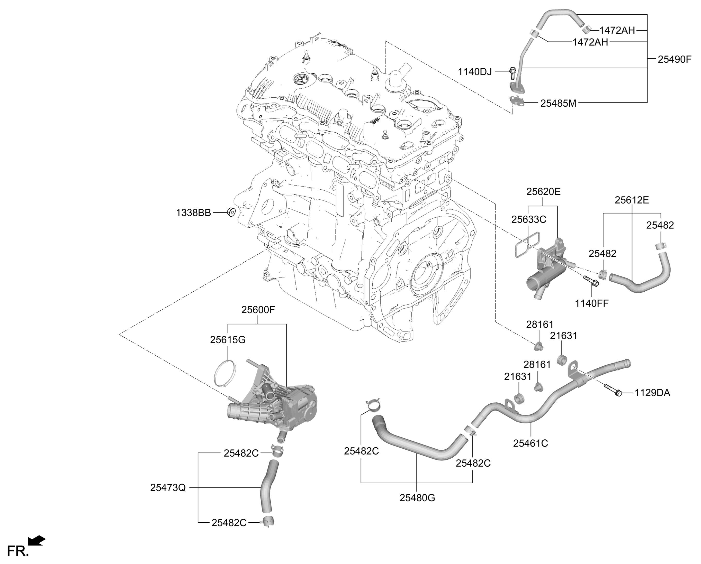
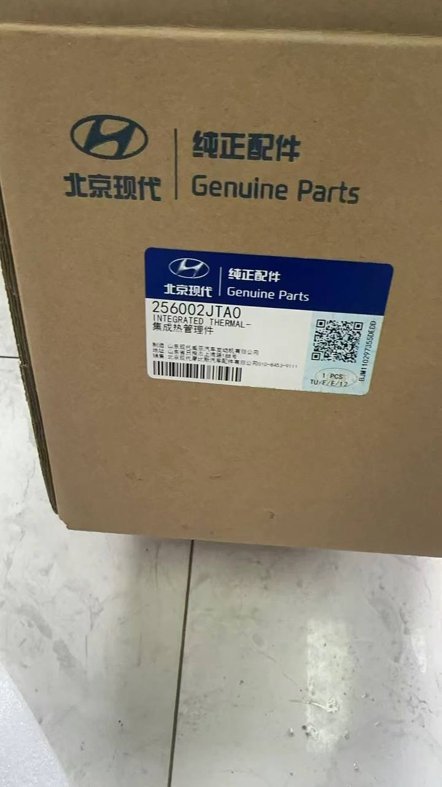
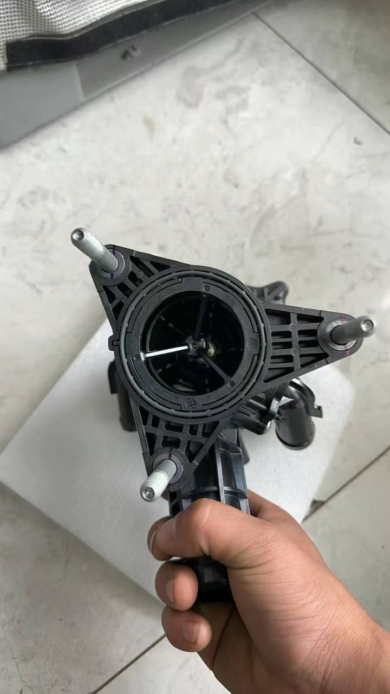
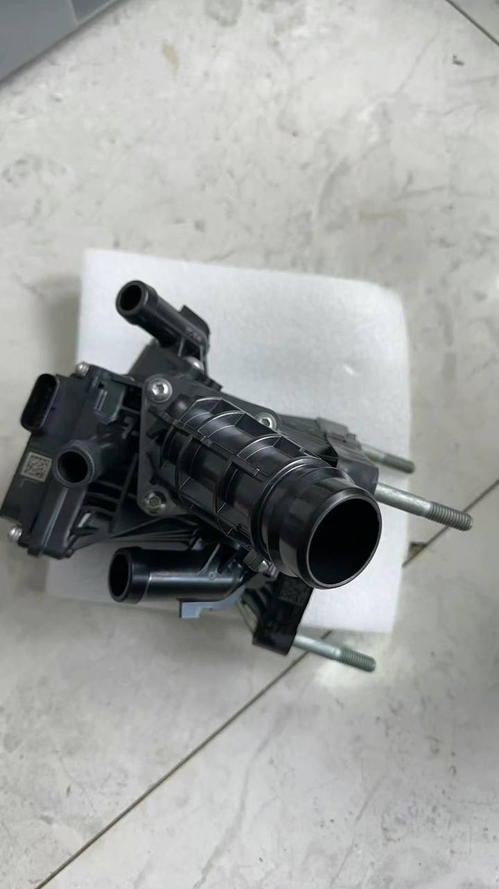
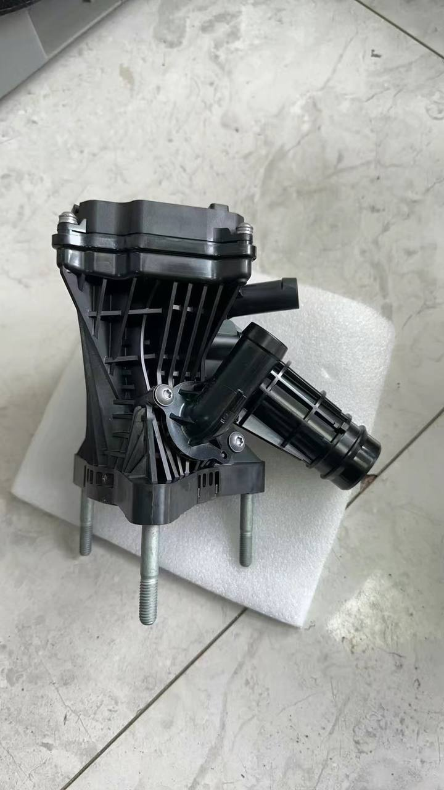

# Двигатель

!!! warning "Раздел в стадии наполнения"

!!! info "[Источник информации](https://t.me/Kia_Sportage_5_Turbo/36156/148836)"

!!! info "О чтении схемы"
    На схемах обозначены номера деталей. В таблицах указаны номера из схем и артикул, соответствующей этому номеру. 
    
    Если схема ссылается на другую схему, то указывается номер схемы и/или дается ссылка на эту схему
    
    ***Курсивом*** обозначены альтернативные артикулы (парт-номера), которые перечислены в этих схема производителем

    Ссылки в артикулах ведут на страницу с альтернативами, которые уже известны и были определены ранее в разделе [Номера запчастей](../../part/index.md)
    
## Двигатель в сборе

??? info "Схема"
    
{ loading=lazy }
    { loading=lazy }

| Номер на схеме | Наименование | Артикул | Кол-во |
|---|---|---|---|
|21101 | Двигатель в сборе-суб.| 73BD1-2JW00 | 1 |
|21102 | Двигатель в сборе | 30BD2-2JW00 | 1 |

## Комплект прокладочных колец

??? info "Схема"
    
{ loading=lazy }

| Номер на схеме | Наименование | Артикул | Кол-во |
|---|---|---|---|
|20910| 20910-2JW01 | Комплект прокладочных колец-двигатель | 1 |
|20920 | 20920-2JW01 | Комлпект прокладочных колец-двигатель, верхн.| 1 |

## Блок цилиндров [20-211B]

??? info "Схема"
    
{ loading=lazy }

| Номер на схеме | Наименование | Артикул | Кол-во |
|---|---|---|---|
|1140FS|Болт|11403-08656K|10|
|1170AA|Болт|11703-06121|4|
|1430FJ|Установочный штифт|14303-10140|2|
|1430JK|Установочный штифт|14303-08140|2|
|1433CA|Втулка|14331-08090|1|
|1573JL|Колпачок-уплотнение|15734-20000|4|
|1710AA|О-Кольцо|21144-2B001|1|
|21110B|Блок в сборе-суб цилиндр|10BM3-2JW00 *21110-2JTA2*|1|
|21114|Болт|21114-2JRA0|10|
|21124|Втулка-ударн.|21124-2A100|2|
|21133|Заглушка|21133-25000|1|
|21150|Форсунка-масл.|21150-2J000|4|
|21161B|О-Кольцо|21143-04010|1|
|21171E|Водяная рубашка охлаждения двигателя|21171-2JTA5|1|
|21171F|Водяная рубашка охлаждения двигателя|21172-2JTA5|1|
|21443|Сальник|21443-2J000|1|
|22124B|Втулка-ударн.|21124-2E000|10|
|22127A|Шпилька|22127-03000|2|

## Блок двигателя

??? info "Схема"
    
{ loading=lazy }

| Номер на схеме | Наименование | Артикул | Кол-во |
|---|---|---|---|
|1140EW| Болт| 22127-2E000 | 8 |
|1140FD| Болт| 11403-08166K| 2 |
|1140FL| Болт | 11403-08383 | 2 |
|1140FP| Болт | 11403-08503| 4|
|1140MA| Болт | 22126-2E000| 16 |
|1430JB| Установочный штифт | 14303-05120| 2|
|1430JK| Установочный штифт | 14303-08140| 2|
|1433CA| Втулка | 14331-08090| 6 |
|1573JM| Колпачок-уплотнение| 15734-28000| 1 |
|1601DG| Шар-сталь | 16011-10000| 5 |
|1751GI| Прокладочное кольцо | 17512-22000| 2 |
|22110B| Вспомогательный узел головки блока-цилиндра | 20BM4-2JW00 22110-2JTA0| 1 |
|22114A| Направл.-впускной клапан | 22114-2J000| 16|
|22124B| Втулка-ударн. | 22124-33000| 4 |
|22125A| Шпилька | 22131-2G000| 2 |
|22127A| Шпилька | 22127-2M800| 4 |
|22129| Заглушка| 22129-2E000| 1|
|22129A| Болт | 22129-2M800| 2 |
|22135| Трубка гнезда свечи зажигания| 22135-2E000| 4 |
|22311| Прокладочное кольцо-головка бл.цилиндр.| 22311-2JTA0| 1|
|22321| Болт | 22321-2JTA0 | 10 |
|22322| Шайба | 22322-2J000| 10 |
|22340| Адаптер топливного насоса | 22340-2J600 | 1 |
|22341D| Держатель-двигатель, задн.часть| 22342-2JTA0 | 1 |

## Головка блока цилиндров

??? info "Схема"
    
{ loading=lazy }

| Номер на схеме | Наименование | Артикул | Кол-во |
|---|---|---|---|
|1140ES|Болт|11403-06286K| 18|
|1472AB|Зажим-шланг|14720-15006S|2|
|1472AR|Хомут-шланг|22410-2JTB0| 2|
|22410A|Крышка в сборе-коромысло| 22410-2JTB0|1|
|22440A|Крышка|22420-2JTA0|1|
|22441|Прокладочное кольцо-крышка коромысла|22441-2JHA0|1|
|22443B|Уплотнение-масл.|22443-2JTB0|4|
|22443F|Уплотнительное кольцо клапанной крышки двигателя|22444-2J000| 3| 
|26502| Набивка-крышка масленки| 26502-22600| 1|
|26510| Колпачок в сборе-масл.|26510-2M000|1|
|26710|Шланг в сборе-вентиль|26710-2JTA1|1|
|26730C|Трубка|26730-2JTA0|1|
|26740| Клапан| 26740-2M000|1|
|29246A| Болт|29243-2B400|3|
|31822|Кронштейн топливного насоса|22442-2JHA0|1|

## Масляная система

??? info "Схема"
    
{ loading=lazy }

!!! note "Схема ссылается на следующие схемы: [Поддон двигателя и масляный щуп [20-215B]](#20-215b) ; [Блок цилиндров [20-211B]](#20-211b)"

| Номер на схеме | Наименование | Артикул | Кол-во |
|---|---|---|---|
|1140AO|Болт-фланец| 11403-08326K | 2 |
|1140DJ|Болт-фланец|11403-06166K|5|
|1140FM|Болт|11403-08407B|1|
|1140FX|Болт|21515-2J000|4|
|1140JF|Болт-фланец|11403-08306K|3|
|21324A|Клапан контроля давления масла|21324-2JTA0|1|
|21513A|Прокладочное кольцо-пробка смаз.|2151323001|1|
|21516A|Болт|21516-35010|1|
|25460|Маслоохладитель|26400-2J001|1|
|25624B| Фиксатор| 21325-2J000|1|
|26100| Насос в сборе-масл.|21300-2JTA2 {#21300-2JTA2} |1|
|26300| Масляный фильтр ак |26300-2JTA2|1|
|26311| Колпачок масляного фильтра | 26315-2J000|1|
|26320A| Комплект обслуж. масляного фильтра| [26350-2J001](../../part/filters.md#oilfilter20T) | 1|
|26331D| Прокладка масляного фильтра двигателя |26331-2J000|1|
|26332B| Заглушка | 26332-2J000 *26332-2S000*|1|
|26347| Прокладочное кольцо | 26333-2J000| 1|
|263A0| Корпус масялного фильтра в сборе | 263A0-2J601| 1|
|94750| Датчик давления масла | 94750-2M454 | 1|

## Поддон двигателя и масляный щуп [20-215B]
??? info "Схема "
    
{ loading=lazy }

| Номер на схеме | Наименование | Артикул | Кол-во |
|---|---|---|---|
|11403C| Болт-фланец|21356-2B000|2|
|1140AO| Болт-фланец| 11403-08326K| 17 |
|1140EJ| Болт | 11403-06126K| 2 |
|1140FN| Болт | 11403-08506K| 12 |
|1140FX| Болт | 21515-2J000| 2|
|1140GD| Болт | 11403-08286K|4|
|1140HK| Болт | 21152-2M000| 4| 
|1140JD| Болт | 11406-10506K | 4|
|1140NA| Болт| 11406-10756K | 1 |
|1430JB| Установочный штифт | 14303-05120 | 2 |
|1433CA| Втулка | 14331-08090| 1 |
|21133| Заглушка | 21133-03000 | 1 |
|21187P| Прокладочное кольцо| 211340-3000| 1 |
|21350F| Кожух в сборе - цепь ГРМ| 21350-2JTA0 | 1 |
|21357B| Болт-фланец | 21359-2E000| 1 |
|21414C| Крышка двигателя | 21414-2J001 |1|
|21421| Уплотнение-масл.| 21421-2G1000| 1| 
|21451B| Прокладочное кольцо-жидк.| 21451-33T00|1|
|21510| Чашка в сборе-масл.| 21510-2JTA2| 1|
|21512| Пробка масляного картера| 21512-27001| 1| 
|21513A| Прокладочное кольцо - пробка смаз. | 21513-23001| 1|
|21611B| Шпилька | 21671-2E120| 2 |
|26611| Масляный щуп| 2611-2J000| 1 |
|26612B| Направл. в сборе - масломер | 26612-2J000| 1|
|26615| О-кольцо | 26615-2B000 | 1 |

## Подушки двигателя
??? info "Схема "
    
{ loading=lazy }

!!! note "Схема ссылается на следующие схемы: 60-624 и 60-640"

| Номер на схеме | Наименование | Артикул | Кол-во |
|---|---|---|---|
|1124AA| Болт | 21891-2Z000| 2 |
|1140HC| Болт | 21821-2G536K| 1 |
|1140HT| Болт | 11404-12256K | 5 |
|1140JA| Болт-фланец | 11406-10406K | 2 |
|1339GC | Гайка | 13396-12007K | 3 |
|21810A | Кронштейн-двигатель уст.| 21810-R4100 | 1 |
|21825S| Кронштейн-опора | 21825-R4100 | 1 |
|21830| Крепеж | 21830-R4100 | 1 |
|21838C| Крыло левое | 21838-L1000| 1 |
|21920| Болт | 21991-1J100 | 1 |
|21950R| Опора двигателя | 21950-R4000| 1 |
|51759| Гайка-самоблок. фланец | 51759-F6000| 3 |

## Коленвал и поршень

??? info "Схема "
    
{ loading=lazy }

| Номер на схеме | Наименование | Артикул | Кол-во |
|---|---|---|---|
|1140MF|Болт|21391-2JTA1|6|
|21020D|Вкладыш коленвала|21020-2J000 *21020-2J010* *21020-2J020* *21020-2J030* *21020-2J040* |3|
|21020F|Комплект подшипников скольжения коленвала|21020-2J050 *21020-2J060* *21020-2J070* *21020-2J080* *21020-2J090* |2|
|21030C|Подшипник-упорн.коленвала|21030-2J000|1|
|23040A| Комплект поршневых колец | 23040-2JTA0| 1|
|23060B| Подшипник-сеодин.шток скольж. | 2306-2J000  *2306-2J010* *2306-2J020* *2306-2J030* *2306-2J040* | 4|
|23111| Коленвал |23111-2JTA2 *23111-2JTB0*|1|
|2312B| Шкив коленвала | 23124-2JTD0|1|
|23125| Ключ | 23125-25000| 1 |
|23127B| Болт-шайба| 23127-2J010 | 1|
|23211B| Ведущий диск | 23211-2JTA0 |1|
|23226B| Переходной фланец| 23226-2S000|1|
|23300| Балансирный вал в сборе| 23300-2JTA0|1|
|23311B| Болт| 23311-2J010|8|
|23410G| Поршень, палец и стопорное кольцо в сборе| 23041-2JTA0 *23041-2JTB0* *23041-2JTC0* |4|
|23412| Штифт | 23412-2JTB0|4|
|23414| Стопорное кольцо КПП |23413-2C400|8|
|23510| Шатун в сборе | 23510-2JTA0| 8 |
|23513| Болт-соединит. шток| 23513-2J000|10|
|39190A| Зуб.венец датчика коленвала| 23141-2J001|1|
|39191| Винт-колесо датчика положения коленвала| 39191-2J200|3|

## ГРМ, гидрокомпенсаторы

??? info "Схема "
    
{ loading=lazy }

| Номер на схеме | Наименование | Артикул | Кол-во |
|---|---|---|---|
|1140EN|Болт|11403-06203|2|
|1140ER|Болт|11403-06253|2|
|1140FE|Болт|11403-08186K|2|
|1140FY|Болт|11403-06146K|2|
|22211|Впускной клапан двигателя|22211-2J000|8|
|22212|Выпускной клапан двигателя|22212-2JTA0|8|
|22221|Пружина клапана| 22221-2J000|8|
|22221P|Пружина клапана|22221-2JTA0|8|
|22222|Тарелка клапанной пружины| 22222-2J100|16|
|22224B|Маслосъемный колпачок| 22224-2G000| 16|
|22231|Гидрокомпенсатор| 24610-2M000 *24610-2S001*|16|
|22235|Замок-пруж.клапана|22223-2A800|32|
|23120|Звездочка коленвала|23121-2JTB0|1|
|24100C|Коленвал-впуск|24100-2JTA0|1|
|24200A|Коленвал-выхлопн.|24200-2JTA0|1|
|24321|Цепь-синхр.|24321-2JTA0|1|
|24348|Упорное кольцо коленвала|24348-25001|2|
|24349|Болт|23439-2E000|1|
|24350|ГРМНР-впуск|24350-2JTA0|1|
|24354A| Соленоидный клапан|24354-2J000|1|
|24354A| Соленоидный клапан|24374-2J000|1|
|24355H| Болт распредвала| 24355-2J000|1|
|24355I| Болт| 24375-2J000|1|
|24370B| Электрическая система газораспределения с бесступенчатым регулированием-выпуск|24370-2JTA0|1|
|24410| Натяжитель ремня ГРМ| 24410-2JTA2|1|
|24420| Направляющая цепи привода ГРМ| 24420-2JTA0|1|
|24431| Направляющая| 24430-2J000|1|
|24440A| Направляющая распред.вала для цепи привода ГРМ| 24440-2JTA0|1|
|24470| Гидравлический натяжитель в сборе| 24470-2JTA0|1|
|24471| Направл.-масляный насос| 24471-2JTA1|1|
|25641| Рычаг-повортн.| 24551-2J000 *24551-2J100*|16|
|26174P| Цепь-масляный насос| 24322-2JTA0|1|
|27242|Болт|24362-2E700|4|

## Ремень (навесное оборудование)

??? info "Схема "
    
{ loading=lazy }

!!! info "Поликриновый ремень 25212-2JTB0 - 6PK 1583"

| Номер на схеме | Наименование | Артикул | Кол-во |
|---|---|---|---|
|1123GG|Болт|11233-06146K|4|
|1140ET|Болт|11403-06306K|5|
|25100|Насос в сборе - охлаждающая жидкость|25100-2J100|1|
|25124|Прокладочное кольцо - водяной насос| 25124-2J100|1|
|25212A| Поликлиновой ремень|25212-2JTB0|1|
|25221| Шкив насоса охл.жидкости|25221-2JTA1|1|
|25281| Натяжитель ремня ГРМ| 25281-2J000| 1|
|25287I| Шкив натяжителя ремня ГРМ| 25287-2E300|1|

## Радиаторы и вентилятор охлаждения

??? info "Схема "
    
{ loading=lazy }

| Номер на схеме | Наименование | Артикул | Кол-во |
|---|---|---|---|
|1125AD|Болт|11254-06206B|9|
|1125DB|Болт|11251-06206B|4|
|13396|Гайка-фланец|13396-06007K|2|
|1463AA|Зажим|14206-08250B|1|
|14722B|Хомут-шланг|14722-43006S|4|
|25310|Радиатор в сборе|25310-R4000|1|
|25318|Пробка сливного отверстия радиатора|25318-1D100|1|
|25333|Крепеж|25333-D3000 *25333-R3000*|1|
|25335|Внутренний крепеж|25335-2P000|1|
|25336|Внутренний крепеж|25336-C5000|2|
|25380|Вентилятор|25380-R4000|1|
|25410L|Шланг радиатора в сборе, нижн|25415-R4200|1|
|25414H|Шланг радиатора в сборе, верхн|25414-R4200|1|
|25430|Бак и шланг|25430-R4000|1|
|25441A|Колпачок-резервуар радиатора|25441-26100|1|
|25450H|Шланг-вода|25450-R4000|1|
|25485F|Коннектор|25485-L1100|1|
|25485J|Коннектор|25485-C1500|1|
|29135A|Топливная системы с пониженной токсичностью выхлопа|29135-R4000|1|
|29150|Спойлер|29150-R4000|1|
|97606|Конденсатор в сборе|97606-N9010|1|
|97761P|Трубка и труба в сборе|97761-R4000|1|
|97852С|Колпачок-осушитель|97852-1J000|1|
|97853A| Осушитель в сборе-ресивер-осушитель|97853-2F100|1|

## Термостат

??? info "Схема "
    
{ loading=lazy }

??? info "Фотографии термостата"
    { loading=lazy, allign=left }
    { loading=lazy, allign=right}
    { loading=lazy, allign=left}
    { loading=lazy, allign=right}

| Номер на схеме | Наименование | Артикул | Кол-во |
|---|---|---|---|
|1129DA|Болт|25456-2E100|2|
|1140DJ|Болт-фланец|11403-06166K|1|
|1140FF|Болт|11403-08206K|3|
|1338BB|Гайка|13386-08007K|3|
|1472AH|Зажим-шланг|25482-13006|2|
|21631|Опора|25457-2E801|2|
|25461C|Трубка|25460-2JTA0|1|
|25473Q|Патрубок|25473-2JTA0|1|
|25480G|Шланг системы охлаждения|25480-2JTA0|1|
|25482|Зажим-шланг|25482-18006|2|
|25482C|Зажим-шланг|25482-22066|2|
|25482C|Зажим-шланг|25482-24066|1|
|25482C|Зажим-шланг|25482-26066|1|
|25485M|Прокладка|25485-2JTA0|1|
|25490F|Трубка системы охлаждения|25495-2JTA0|1|
|25600F|Термостатический регулируемый клапан системы охлаждения|25600-2JTA0|1|
|25612E|Патрубок|25481-2JTA0|1|
|25615G|Прокладочное кольцо-корпус термостата|25623-2JTA0|1|
|25620E|Фитинг шланга| 25630-2JTA0|1|
|25633C|Прокладочное кольцо-корпус термостата|25630-2JTA0|1|
|28161|Кольцо|25457-2E802|2|

## Воздушный фильтр и его корпус

??? info "Схема "
    
{ loading=lazy }

| Номер на схеме | Наименование | Артикул | Кол-во |
|---|---|---|---|
|1125DB|Болт|11251-06206B|4|
|11403B|Болт-фланец|11403-06126B|2|
|1463AA|Зажим|14206-08250B|2|
|1471CM|Хомут-шланг|14716-07000|1|
|1471UD|Хомут-шланг|14716-08700|1|
|1471UD|Хомут-шланг|14716-09000|1|
|1799GA|Ремень|17993-35000|1|
|28110|Очист.в сборе-возд.|28110-R4200|1|
|28111|Крышка-очиститель воздуха|28111-R4200|1|
|28112|Корпус воздушного фильтра|28112-R4200|1|
|28113|Воздушный фильтр двигателя|[28113-R4200](../../part/filters.md#airfilter)|1|
|28130|Шланг|28130-R4200|1|
|28139C|Патрубок забора воздуха|28139-R4200|1|
|28160|Опора|28160-3R030|2|
|28160B|Опора|28160-N8400|1|
|28161|Кольцо|28161-F0000|2|
|28164|Датчик расхода воздуха|28164-2M400|1|
|28165B|О-Кольцо|28165-27800|1|
|28171|Болт|28171-2H000|2|
|28174H|Хомут-пластина|28174-02400|2|
|28186F|Арматура регулирующая:клапан системы очистки воздуха для двигателя|28186-R4200|1|
|28210|Воздушная трубка|28210-R4100|1|
|28211G|Воздуховод|28240-N8400|1|
|28212F|Трубка|28212-R4100|1|
|28213A|Воздухозаборник воздушного фильтра двигателя|28213-R4100|1|
|28374|Подкладка|28162-N8400|1|