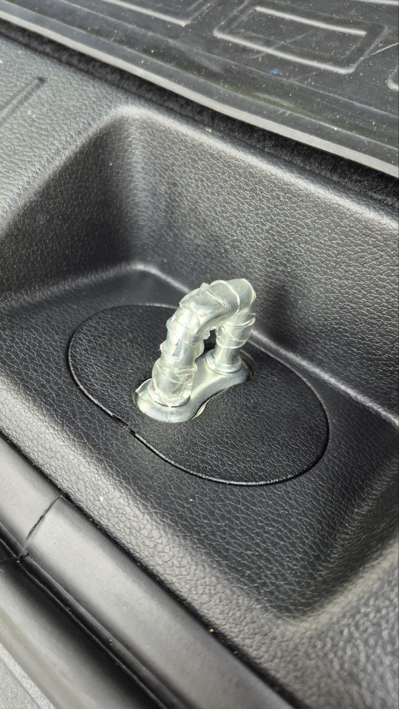
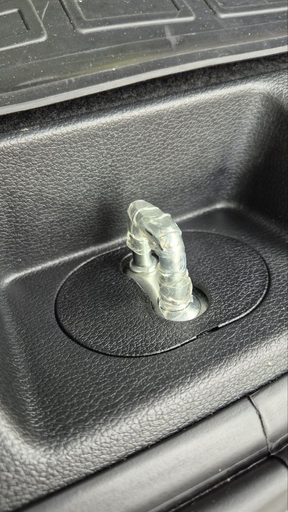

# Устранение бряканья двери багажника на кочках

!!! warning "Идеальный вариант не найден, поэтому возможно имеет смысл последовательно пробовать все варианты!"

## 1. Смазка

Смажьте замок (петлю), а также резиновые демпферы и направляющие. Можно использовать густую силиконовую смазку, н.р. [Silicot Gel](https://ozon.ru/t/wWbTI2B).

## 2. Калибровка (инициализация) механизма открытия двери багажника

Выполните мероприятия по данной [инструкции](5-th_door_calibraton.md)

## 3. Замена демпферов багажника

Купите и замените демпферы багажника, также отрегулируйте его (методом проб и ошибок). 
Необходимый демпфер (нужно 2 шт.): [81738-1J000](https://ozon.ru/t/CPfBoGU)

Также выполните [калибровку механизма открытия двери багажника](5-th_door_calibraton.md)

## 4. Обматать петлю замка тонкой лентой

Попробуйте обмотать петлю замка тонкой лентой в **один слой**. Есть положительный опыт использования [данной ленты](https://ozon.ru/t/Gv2zLKS)

??? info "Фотография петли с намотанной лентой"

    { loading=lazy }
    { loading=lazy }

??? info "Пример ленты"
    { loading=lazy }

Также выполните [калибровку механизма открытия двери багажника](5-th_door_calibraton.md)