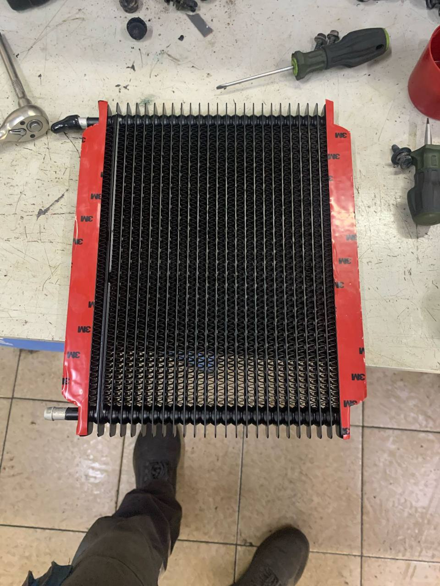
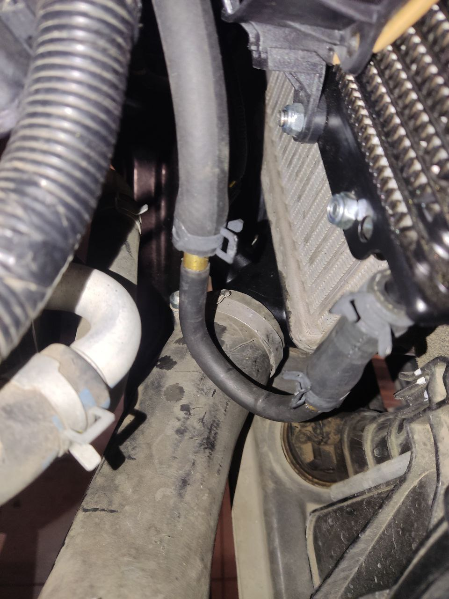
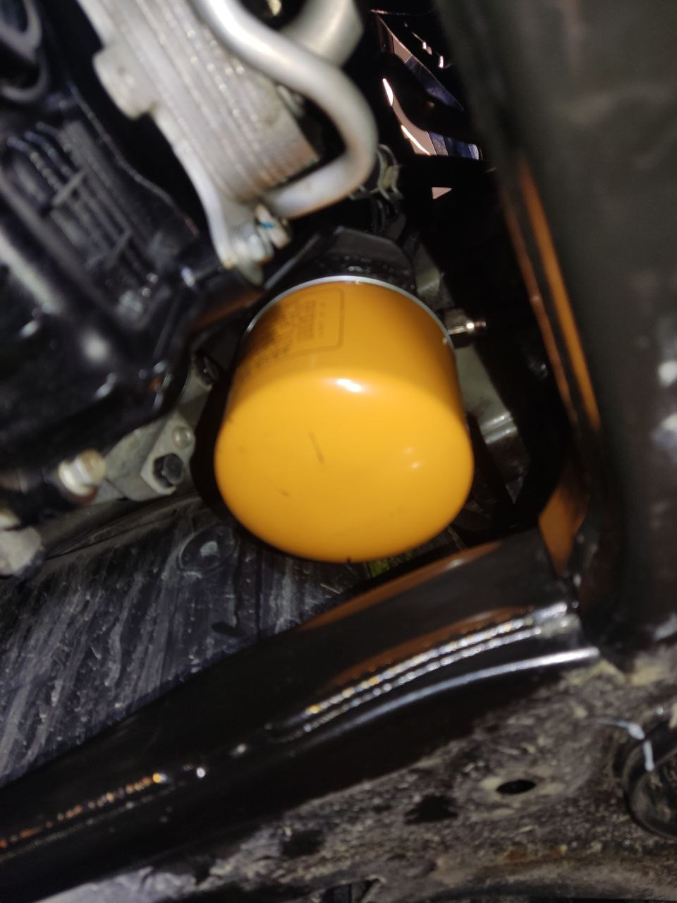

# Установка радиатора АКПП

Есть проблема с перегревом АКПП на больших скоростях или под большой нагрузкой, особенно в жару.

Охлаждение АКПП организовано через теплообменник. В данном решении есть как и плюсы (например, АКПП быстро прогревается в холодное время года, за счет мотора) так и минусы (температура АКПП не может быть ниже температуры двигателя).

Для решения проблем с охлаждением АКПП можно установить внешний радиатор. Есть положительный опыт установки радиатора с встроенным байпасом: Hayden OC-698.

Для установки внешнего радиатора понадобится:

1. Радиатор АКПП, н.р., Hayden OC-698
2. Крепление для фиксации радиатора АКПП
3. Необходимые шланги Gates 11/32 дюйма диаметр (9 мм), арт. 8005278 (1.5м, которые идут с OC-698 недостаточно, нужно еще)

Подключение возможно несколькими способами: 

1. В разрез выхода из теплообменника, сохраним теплообменник
2. К АКПП на прямую, тем самым исключая теплообменник из контура охлаждения

У обоих вариантов есть плюсы и минусы, тут на ваше усмотрение

??? info "Фото и видео примеров установки без дополнительного вентилятора"

    { loading=lazy }
    { loading=lazy }
    { loading=lazy }

    [Видео 1](https://t.me/Kia_Sportage_5_Turbo/36156/110035)

    [Видео 2](https://t.me/Kia_Sportage_5_Turbo/36159/107191)

??? info "Фото примера установки с дополнительным вентилятором и фильтром"    

    В фильтре стоит тремореле, которое включает вентилятор при достижении температуры 87-92 градусов

    { loading=lazy }
    { loading=lazy }
    { loading=lazy }
    { loading=lazy }
    { loading=lazy }