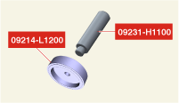
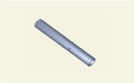
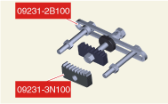
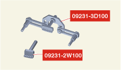
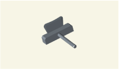
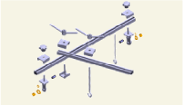
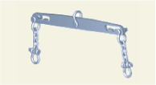

# Специальные сервисные инструменты

|Название/номер инструмента|Иллюстрация|Описание|
|---|---|---|
|Приспособление для установки переднего сальника коленчатого вала 09214-2J100 (приспособление для установки) 09231-H1100 (ручка) ||Используется для установки переднего сальника коленчатого вала|
|Приспособление для установки заднего сальника коленчатого вала 09214-L1200 (приспособление для установки) 09231-H1100 (ручка)||Используется для установки заднего сальника коленчатого вала|
|Компрессор пружин клапанов 09222-3K000 Адаптер компрессора пружин клапанов 09222-3K100||Используется для снятия/установки впускного или выпускного клапана.|
|Установщик маслосъемных колпачков 09222-2E000| |Используется для установки маслосъемного колпачка|
|Стопор зубчатого венца 09231-3N100 09231-2B100||Используется для предотвращения вращения зубчатого венца при снятии/установке болта шкива коленчатого вала.|
|Стопор зубчатого венца 09231-3D100 09231-2W100||Используется для предотвращения вращения зубчатого венца при снятии/установке болта шкива коленчатого вала.|
|Съемник масляного поддона 09215-3C000| |Используется для снятия масляного поддона|
|Подвеска двигателя  09221-03100||Используется с креплением для опоры двигателя|
|Крепление для опоры двигателя (балка) 09200-3N000| |Используется для удерживания двигателя при снятии/установке коробки передач.  Используется с адаптером (09200-4X000) и опорой (09200-2S000). **※ См. чертеж сборки опорного приспособления двигателя ниже.**|
|Узел крепления опоры двигателя 09200-2S000 Узел крепления опоры двигателя 09200-2S100 09200-2S200||Используется для удерживания двигателя при снятии/установке коробки передач. Используется со штангой (09200-3N000) и адаптером (09200-4X000). **※ См. чертеж узла крепления опоры двигателя ниже.**|
|Крепление для опоры двигателя (адаптер) 09200-4X000||Используется для удерживания двигателя при снятии/установке коробки передач. Используется со штангой (09200-3N000) и опорой (09200-2S000). **※ См. чертеж узла крепления опоры двигателя ниже.**|
|Крепление для опоры двигателя (задняя опора) 09200-L1100| |Используется для удерживания двигателя при снятии/установке трансмиссии. **※ См. чертеж узла крепления опоры двигателя ниже.**|

## Чертеж сборки опорного приспособления двигателя

{loading=lazy}