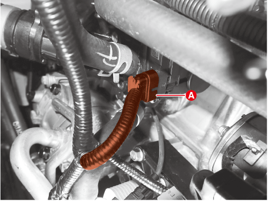

# Процедура замены

!!! danger "Внимание"
    
    - Никогда не снимайте крышку радиатора, если двигатель горячий.
    - Серьезные ожоги могут быть вызваны выбросом горячей охлаждающей жидкости под высоким давлением из расширительного бачка.

!!! info "Уведомление"

    - Обязательно добавляйте охлаждающую жидкость в соответствии с методом заправки охлаждающей жидкости интегрированного модуля терморегулирования (ITM).
    - При доливе охлаждающей жидкости будьте осторожны, чтобы не пролить ее на ремень и электрические приборы.

## Используя KDS, замените охлаждающую жидкость и удалите воздух.

1.	Убедитесь, что двигатель и радиатор достаточно остыли на ощупь.
2.	Снимите крышку давления (А).
    
    
  

3. Снимите крышку моторного отсека.
    (См. раздел «Узел двигателя и трансмиссии» — «Моторное отделение под крышкой»)

4. Снимите сливную пробку (А) и слейте охлаждающую жидкость.
   
    
  

5. После слива охлаждающей жидкости надежно затяните сливную пробку радиатора.
6. Очистите расширительный бачок после слива охлаждающей жидкости из него.
7. Установите бачок для доливки охлаждающей жидкости на радиатор, а затем залейте смесь антифриза и воды (45–50 %) (кроме Северной Америки, Европы и Китая: 55–60 %).

    !!! warning "Заливайте охлаждающую жидкость как можно больше при выключенном двигателе и всех источниках питания."

    ---
    
    **Количество охлаждающей жидкости**
    
    Приблизительно 6,6 л (1,7 галлона США, 7,0 кварты США, 5,8 британской кварты)
    
    ---

    !!! info "Рекомендации"
        
        - Сожмите верхний/нижний шланги радиатора, чтобы воздух мог легко выйти.
        - Используйте только оригинальный антифриз.
        - Не смешивайте антифриз/охлаждающую жидкость разных марок.
        - Не добавляйте никаких антикоррозийных средств.
        - При смешивании антифриза с водой используйте только дистиллированную воду.
        - Для лучшей защиты от коррозии концентрация охлаждающей жидкости должна поддерживаться круглый год на уровне не менее 45% (за исключением Северной Америки, Европы и Китая: 55%).
        - Концентрация охлаждающей жидкости менее 45% (за исключением Северной Америки, Европы и Китая: 55%) может не обеспечить достаточной защиты от коррозии или замерзания.
        - Концентрация охлаждающей жидкости более 60% снизит эффективность охлаждения и не рекомендуется.

8. Подключите KDS к разъему канала передачи данных, а затем включите зажигание.
9. Выполните «Режим заполнения охлаждающей жидкостью интегрированного термического модуля» с помощью KDS в указанном ниже порядке.
(*Управление ПО* → *Управление двигателем* → *Режим заполнения охлаждающей жидкости интегрированного теплового модуля*)
    
    EN: (S/W Management → Engine Control → Integrated Thermal Module Coolant Filling Mode)

    !!! info "Условия эксплуатации и подробности смотрите на экране KDS."

10.	Запустите двигатель.

    !!! info "Дайте двигателю поработать на холостом ходу."

11. Заполните бачок охлаждающей жидкостью.
    
    !!! info "Рекомендация"
        Когда температура охлаждающей жидкости достигнет 90 °C (194 °F) или пройдет 20 минут с момента запуска двигателя, проверьте уровень охлаждающей жидкости в бачке и долейте ее.

12.	Остановите режим заполнения охлаждающей водой интегрированного модуля терморегулирования (ITM) с помощью KDS.
13.	Дайте двигателю поработать, пока не начнет циркулировать достаточное количество охлаждающей жидкости.
14.	Проверьте количество охлаждающей жидкости в бачке, долейте ее до отметки «MAX».
15.	Установить машинное отделение под навесом.

    (См. раздел «Узел двигателя и трансмиссии» — «Моторное отделение под крышкой»)        

## Если использование KDS невозможно, замените охлаждающую жидкость и выпустите воздух.

1.	Убедитесь, что двигатель и радиатор достаточно остыли на ощупь.
2.	Отсоедините отрицательную (-) клемму аккумуляторной батареи.
3.	Снимите крышку давления (А).
    
    
  

4. Снимите крышку моторного отсека.
    (См. раздел «Узел двигателя и трансмиссии» — «Моторное отделение под крышкой»)

5. Снимите сливную пробку (А) и слейте охлаждающую жидкость.
   
    
  

6. После слива охлаждающей жидкости надежно затяните сливную пробку радиатора.
7.	Очистите расширительный бачок после слива охлаждающей жидкости из него.
8.	Отсоедините разъем (A) интегрированного модуля терморегулирования (ITM).

    
  

    !!! warning "Внимание"
        
        - При отсоединении разъема (A) интегрированного модуля терморегулирования (ITM) убедитесь, что двигатель и все питание выключены.
        - Будьте осторожны и не подвергайте интегрированный модуль терморегулирования (ITM) воздействию статического электричества или другого напряжения.
        - Не подносите магнитные предметы, например, магниты, близко к интегрированному модулю терморегулирования (ITM).

9. Установите бачок для доливки охлаждающей жидкости на радиатор, а затем залейте смесь антифриза и воды (45–50 %) (кроме Северной Америки, Европы и Китая: 55–60 %).

    !!! warning "Заливайте охлаждающую жидкость как можно больше при выключенном двигателе и всех источниках питания."

    ---
    
    **Количество охлаждающей жидкости**
    
    Приблизительно 6,6 л (1,7 галлона США, 7,0 кварты США, 5,8 британской кварты)
    
    ---

    !!! info "Рекомендации"
        
        - Сожмите верхний/нижний шланги радиатора, чтобы воздух мог легко выйти.
        - Используйте только оригинальный антифриз.
        - Не смешивайте антифриз/охлаждающую жидкость разных марок.
        - Не добавляйте никаких антикоррозийных средств.
        - При смешивании антифриза с водой используйте только дистиллированную воду.
        - Для лучшей защиты от коррозии концентрация охлаждающей жидкости должна поддерживаться круглый год на уровне не менее 45% (за исключением Северной Америки, Европы и Китая: 55%).
        - Концентрация охлаждающей жидкости менее 45% (за исключением Северной Америки, Европы и Китая: 55%) может не обеспечить достаточной защиты от коррозии или замерзания.
        - Концентрация охлаждающей жидкости более 60% снизит эффективность охлаждения и не рекомендуется.

10. Подсоедините отрицательную (-) клемму аккумулятора.
11. Запустите двигатель.

    !!! info "Дайте двигателю поработать на холостом ходу."

12. Заполните бачок охлаждающей жидкостью.

    !!! info "Прошло 20 минут с момента запуска двигателя, проверьте уровень охлаждающей жидкости в бачке и долейте."

13. Подсоедините разъем (A) интегрированного модуля терморегулирования (ITM) после выключения двигателя.

    
  

14.	После запуска двигателя проверьте звук работы интегрированного модуля терморегулирования (ITM).
15.	Дайте двигателю поработать до тех пор, пока охлаждающая вода не начнет достаточно циркулировать.
16.	Проверьте количество охлаждающей жидкости в бачке, долейте ее до отметки «MAX».
17.	Установите крышку радиатора (А).

    
  

18.	Установить машинное отделение под навесом.

    (См. раздел «Узел двигателя и трансмиссии» — «Моторное отделение под крышкой»)