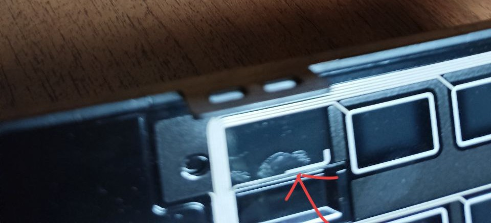
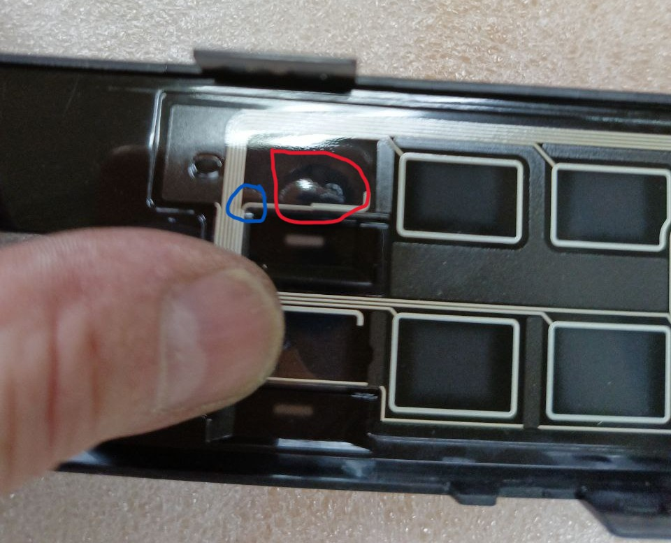
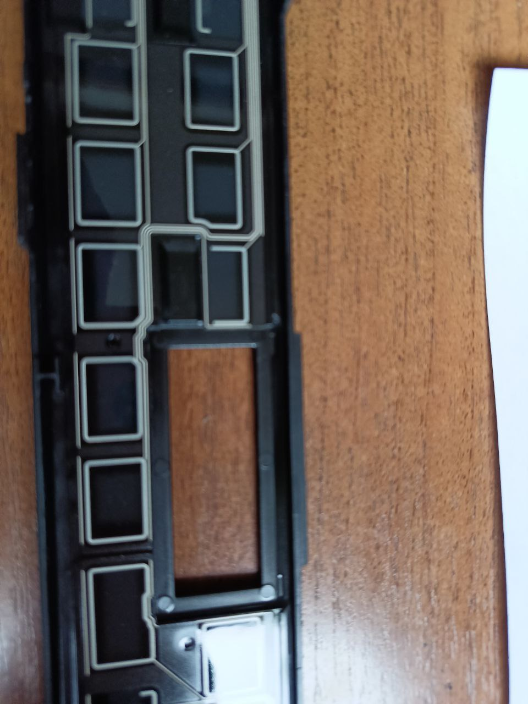
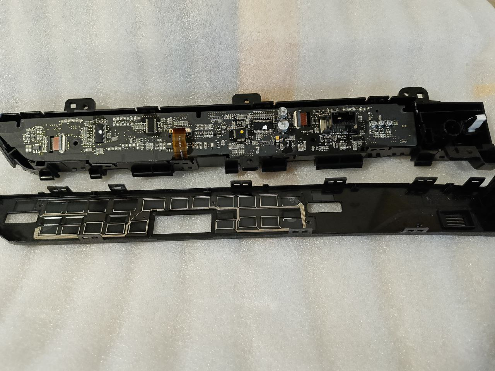
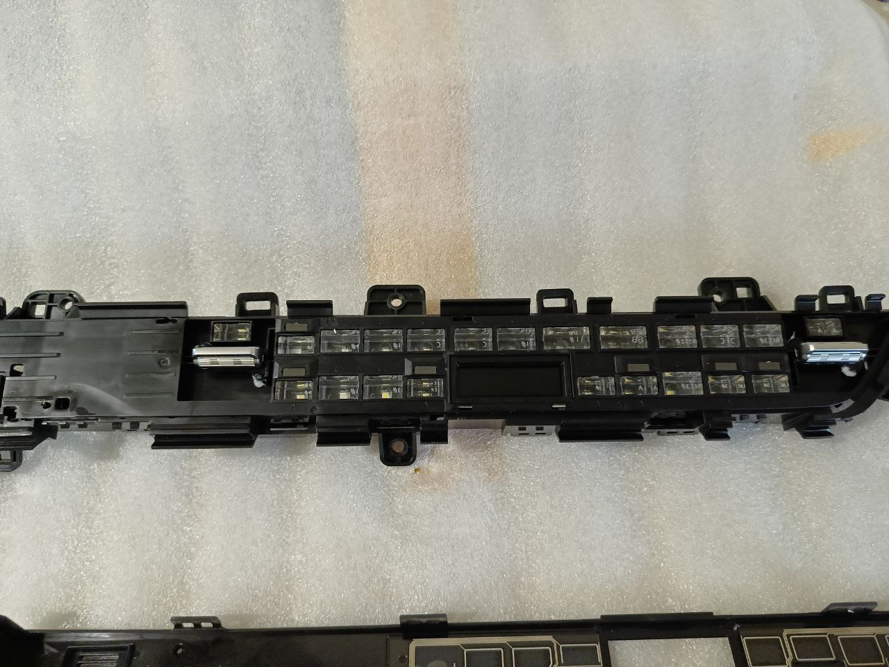

# Решение проблемы с не включением подогрева зеркал

**Признаки:** При нажатии на соответствующую кнопку на панели климата не загорается индикатор включения.

**Причины:** Заводской брак

??? info "Описание заводского брака"
    Если разобрать дефектную панель, то напротив не работающих сенсорных кнопок видет отчетливо пузырь, а также есть деформация шлейфа и его повреждение, что может приводить к произвольным нажатиям на другие кнопки.

    [Источник информации](https://t.me/Kia_Sportage_5_Turbo/36156/142082)

    { loafing=lazy}
    /// caption
    Пузырь
    ///
    
    { loafing=lazy}
    /// caption
    Пузырь и поврежденный шлейф
    ///
    
    { loafing=lazy}
    /// caption
    Остальные сенсоры без пузыря
    ///

    { loafing=lazy}
    /// caption
    Разобранная панель
    ///

    { loafing=lazy}
    /// caption
    Разобранная панель
    ///

## Порядок действий

??? info "Радикальный метод (шанс успеха 99.99%)"
    Заменить панель климата. 
    
    | Комплектация | Артикул |
    | --- | --- | 
    | Premium / Flagship | 97250-R4100 |
    | Luxuary | 97250-R4000 |
    
    На Aliexpress обнаружена панель для Premium/Flagship, но без гарантий на работоспособность и оригинальность: [ссылка](https://aliexpress.ru/item/1005007869437944.html?sku_id=12000042625247564)

    Панель также можно заказать у [Евгения](https://t.me/evgeen55)

??? info "Метод с предохранителями (шанс успеха 30%)"

    !!! warning "Так как проблема связана с заводским браком самой панели, то данный способ не гарантирует работу и есть все шансы решить проблему временно, а не окончательно"

    1. Достать предохранитель №32 на 7.5А.

        ??? info "Фото нужного предохранителя"
            { loading=lazy }

    2. Завести автомобиль (климат работать не будет).
    3. Дать поработать несколько минут.
    4. Заглушить автомобиль.
    5. Вернуть предохранитель.
    
    !!! info "Озвучиваются рекомендации заменить предохранитель на новый, аналогичного номинала."

    После этих действий завести автомобиль и проверить работу.
    
    Если не заработает, то пробуем следующий алгоритм:
    
    1. Отсоединяем минусовую клемму от аккумулятора.
    2. Вынимаем предохранитель №31 (смотрите выше).
    3. Подсоединяем минусовую клемму к аккумулятору.
    4. Запускаем двигатель и даем поработать около 3 минут.
    5. Глушим автомобиль и возращаем предохранитель на место.
    6. Нажимаем на все кнопки климата (начиная с обогрева зеркал, он может не сработать)
    7. После нажатия на все кнопки климата снова нажимаем на обогрев зеркал - должна включиться.

    ??? info "Оригинальное описание процесса от автора"
        Имею 2 новых спортеджа из Китая. Столкнулся на обеих машинах с проблемой неработающей кнопки обогрева заднего стекла и зеркал. Нашел в этой группе, что проблема имеет массовый характер на автомобилях произведенных в периоде март-июнь 2025г. по причине «заводского брака». И возможное решение проблемы, такое как снятие предохранителя, отвечающего за работу климата на неработающем двигателе, затем запуска двигателя без предохранителя и дать несколько минут поработать. Затем вставить предохранитель на место и запустить двигатель, после попробовать нажать кнопку обогрева заднего стекла и зеркал. Указано, что данная процедура помогает в 30% случаев. Если не поможет, то рекомендуется замена панели климата, которая спасает ситуацию в 99% случаев.

        Теперь по экспериментам на двух имеющихся авто в семье с аналогичной проблемой:

        Первый автомобиль «ожил» по «30%» схеме с выниманием предохранителя. 

        Со вторым с первого и второго раза ничего не вышло. Тогда стал экспериментировать с отключением минусовой клеммы аккумулятора. 
        
        Порядок действия в результате которого получилось оживить неработающую кнопку обогрева заднего стекла и зеркал:

        Отсоединяю минусовую клемму аккумулятора. Затем вынимаю предохранитель, отвечающий за работу климата (он есть на схеме здесь) Подсоединяю обратно клемму аккумулятора. Запускаю двигатель. Даю минуты три поработать. Глушу. Вставляю обратно предохранитель. Завожу двигатель. Нажимаю на кнопку обогрева зеркал и заднего стекла. Реакции нет. Жму на остальные кнопки на панели климата и снова нажимаю на кнопку обогрева зеркал и о чудо — кнопка засветилась!

    