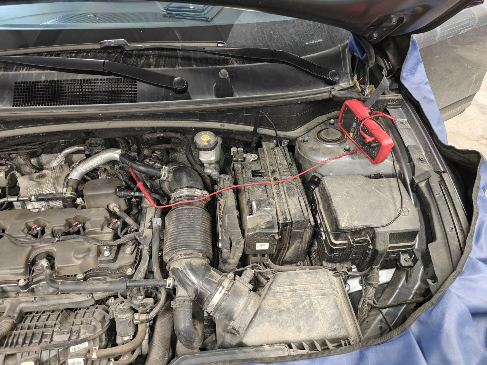
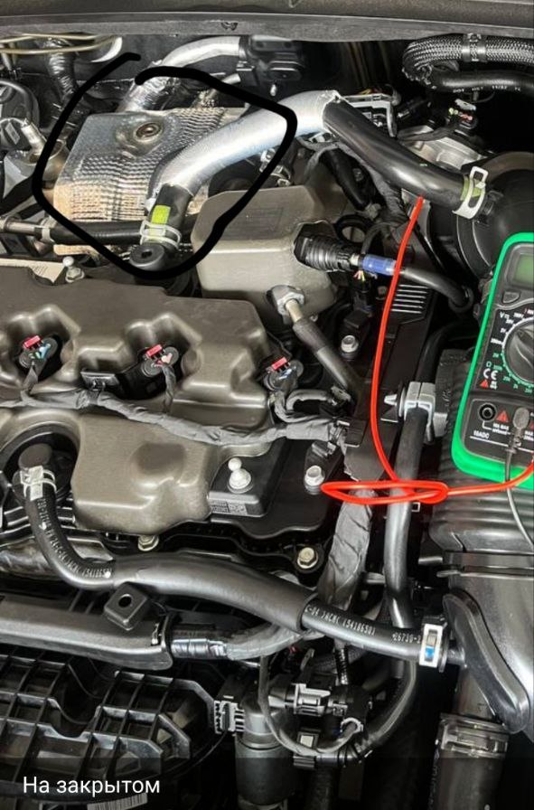
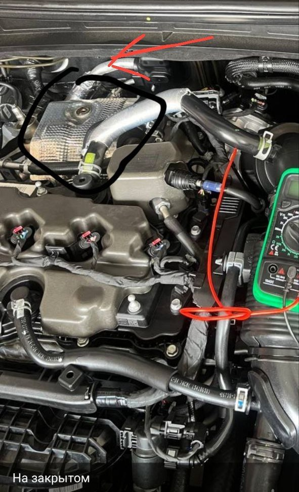
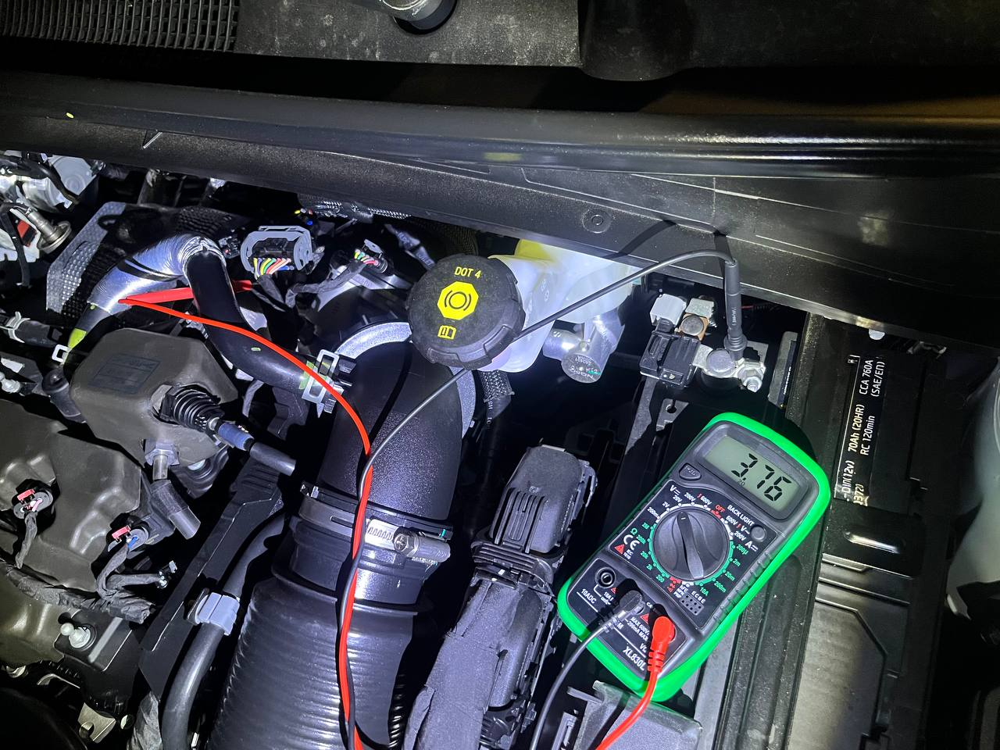
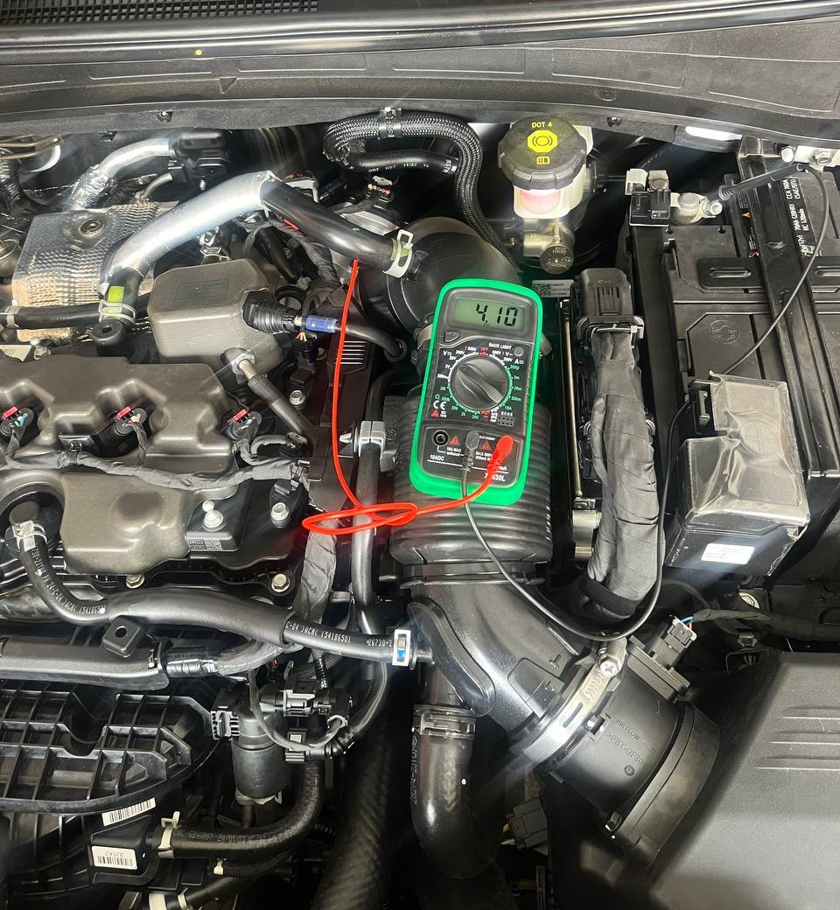
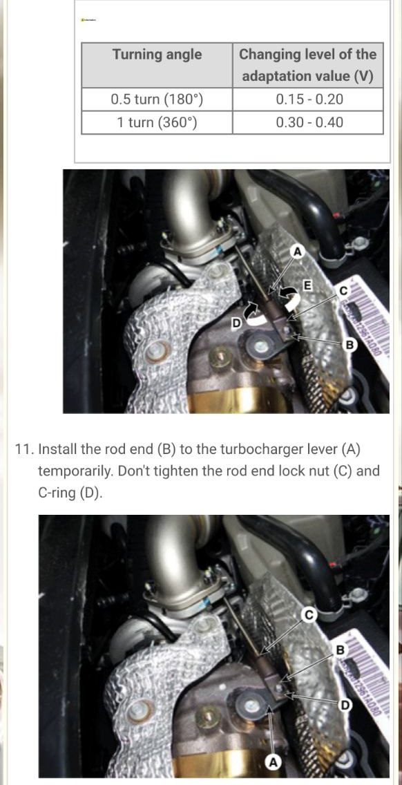

# Устранение проблем в работе турбины (недодув/передув/потеря мощности)

## Демонстрация проблемы

Видео: [ссылка на видео в группе ТГ](https://t.me/Kia_Sportage_5_Turbo/1/120742)

## Порядок действий:
1. Даем машине остыть.
2. Открываем капот.
3. Откручиваем 2 болта сверху теплозащиты турбины и отводим её в сторону. Получаем доступ к тяге геометрии турбины.
4. На штоке есть 2 контргайки, по одной с каждой стороны, отжимаем их.
5. Регулировка:
    - подключаем диагностический комп к машине, выбираем блок упраления геометрией и смотрим напряжение, которое выдает шток при полном открытии геометрии, если оно больше 4.2V (± 0.1V), крутим шток, чтобы стало 4.2V (± 0,1V).
    - если нет софта на компе, то берем иголку и пробиваем ей желтый провод около фишки которая подключается к механизму управления геометрией турбины. К иголке присоединяем "+" от тестера, "-" от тестера на "-" АКБ. Включаем зажигание. Двигаем шток, в самом крайнем положении(шток максимум в лево по ходу движения машины) показания вольтметра должны быть 4.2V (±0.1V), если показания больше, то крутим шток, тем самым регулируя длину его хода.
    ??? note "Фото"
        { loading=lazy}
        { loading=lazy}
        { loading=lazy}
        { loading=lazy}
        { loading=lazy}
        { loading=lazy}
        { loading=lazy}
        { loading=lazy}
        { loading=lazy}
6. Выставили 4.2V (±0.1V), контрим шток гайками и убираем провода.
7. Прикручиваем теплозащиту турбины.
8. Закрываем капот.

Желательно сделать адаптацию педали газа по данной [инструкции](./gas-adaptation.md)

{ loading=lazy }
/// caption
Параметры из мануала "собрата"
///

??? note "Скриншоты процесса из официальной документации"
    

    { loading=lazy }
    { loading=lazy }
    { loading=lazy }
    { loading=lazy }
    

??? note "Еще скриншоты процесса из официальной документации"
    

    { loading=lazy }
    { loading=lazy }
    
    