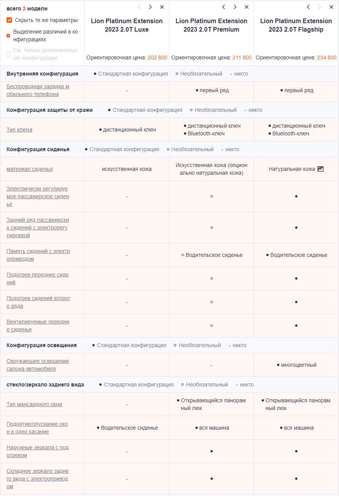
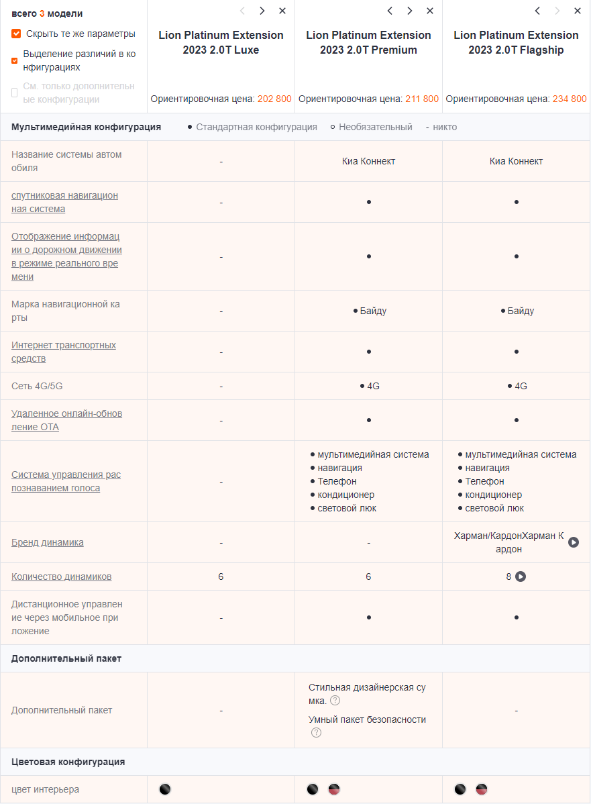

# Сравнение комплектаций и другими рынками

## Обзоры на авто

<iframe width="560" height="315" src="https://www.youtube.com/embed/wRtgfU-eTrY?si=RuoddTHqm2YCF-pn" title="YouTube video player" frameborder="0" allow="accelerometer; autoplay; clipboard-write; encrypted-media; gyroscope; picture-in-picture; web-share" referrerpolicy="strict-origin-when-cross-origin" allowfullscreen></iframe>

## Различия с Корейской и Казахской сборкой

### Сравнение с Казахской версией

У Китайской версии в отличии от Казахской:

- Другие моторы (1.5 турбо и 2.0 турбо у Китайца, против 2.0 и 2.5 атмосферных у Казахов)
- Отсутствует датчик дождя (автоматическая работа дворников)
- Отсутствует подогрев руля (можно исправить: установить самому спираль, либо [так](improvement/wheel-heating.md))
- Отсутствует подсветка в бардачке
- Отсутствует подогрев лобового стекла
- Отсутствует подсветка в водительском и пассажирском козырьке
- Отсутствуют крепления для ковриков (можно купить отдельно)
- Отсутствуют ПТФ
- Отсутствует регулировка упора поясницы
- Размер бака омывайки 2.5 литра вместо 5 литров
- **Не все** расходники, вроде воздушного фильтра, подходят от Казахстанской версии
- Крепления дворников не стандартные
- Отсутствует крепление шторки багажника, как и сама шторка
- Отсутствуют брызговики
- Датчики давления в шинах (52940-O3100) отличаются от Казахских (52940-L1100 **НЕ подходят**)
- Отсутствует функция запуска с брелка и управление движением машины с брелка (есть на некоторых комплектациях из Казахстана)

### Сравнение с Корейской версией
По габаритам Китайский длиннее на 1см и выше на 2см, по клиренсу китайский 156 против 180 у корейского, но визуально клиренс одинаковый.

## Сравнение комплектаций
## 2.0T
{ loading=lazy }

{ loading=lazy }

{ loading=lazy }

## 1.5T

{ loading=lazy }

## Источники данных:

- [Китай](https://price.pcauto.com.cn/sg28996/config.html#ad=20417)
- [На Русском (могут быть неточности)](https://aurum-motors.ru/kia-sportage-komplektacii-2023/)